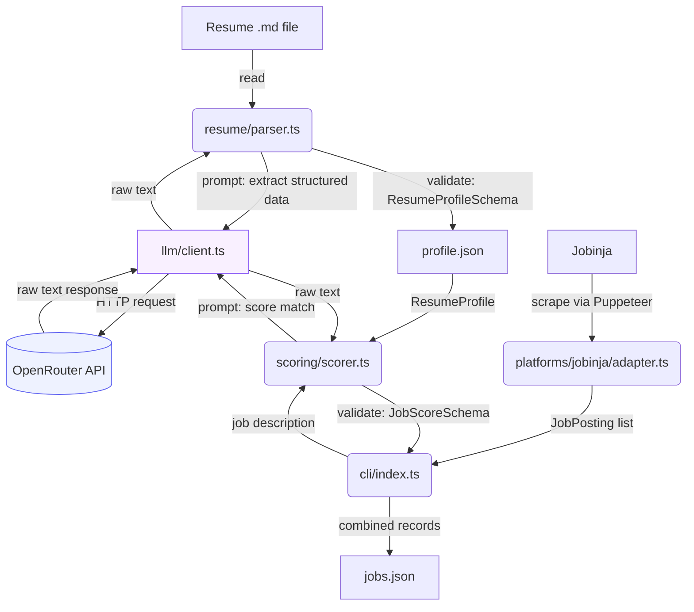

# Jobwright

A self-hosted, open-source CLI tool that parses your resume, matches it against job postings across multiple platforms, and auto-applies to the ones that fit — built for developers who want a real, ownable alternative to manually scrolling job boards.

**Status: V2 — resume-to-job scoring engine.** Auto-apply and application tracking are not implemented yet.

## What Jobwright does so far

1. Reads a resume from a local Markdown (`.md`) file
2. Sends it to an LLM (via OpenRouter) to extract structured data — name, skills, and work history
3. Computes total years of experience and a seniority level from that work history in code (not by the LLM — see note below)
4. Validates the result against a strict schema and saves it to `profile.json`
5. Searches Jobinja for job postings matching a query, using a headless browser
6. Visits each matching posting and extracts its full description and metadata (location, work type, required experience, etc.)
7. **New in V2:** scores each job posting against your resume using an LLM, producing a 0–100 match score, a count of requirements met vs. total, a list of missing requirements, and a short reasoning summary
8. Saves every scored job — score, reasoning, and all — to `jobs.json`

Nothing is auto-applied to or tracked yet — this version proves the scoring pipeline works end to end, on top of V1's extraction pipeline.

## How it talks to the LLM

Jobwright never lets the LLM touch a browser or make decisions about *what* to do — it's only ever asked to read text and return structured data. Everything else (scraping, filtering, orchestration) is deterministic code.



`llm/client.ts` is a thin, generic wrapper — it knows nothing about resumes or job postings. It takes a finished prompt string and returns whatever text OpenRouter sends back. `resume/parser.ts` and `scoring/scorer.ts` each build their own prompt and are responsible for validating the response against their own schema. The LLM's role is strictly "read this text, extract/judge this specific thing" — never "decide what to do next."

## Requirements

- Node.js (v22+ recommended)
- An [OpenRouter](https://openrouter.ai) API key

## Setup

```bash
git clone https://github.com/MB-PieSec/jobwright.git
cd jobwright
npm install
```

Create a `.env` file in the project root with your OpenRouter API key:

```
openRouterAPIKEY=your_key_here
```

## Usage

```bash
npm start
```

On first run, you'll be prompted for the path to your resume (Markdown only for now). The parsed, validated profile is saved to `profile.json` — on subsequent runs this step is skipped if `profile.json` already exists, and the existing profile is loaded and re-validated instead.

The tool then opens a browser, searches Jobinja for a (currently hardcoded) query, scores each matching job against your resume, and saves every scored job to `jobs.json`.

### CLI flags

Both flags accept `--flag=value` or `--flag value` form.

| Flag | Default | Description |
|---|---|---|
| `--reasoning-length` | `200` | Target character length for each job's scoring reasoning |
| `--min-score` | `70` | Score threshold — jobs below this are logged as "Ignored" instead of showing their score (they're still saved to `jobs.json` either way) |

## Resume format

Only **Markdown** resumes are supported. PDF and DOCX are not implemented yet. Structure your resume with clear section headers (e.g. `## Experience`, `## Skills`) — this measurably improves extraction accuracy, since the LLM uses your headers as structural signal.

## Model recommendations

Scoring quality depends heavily on the model you configure in `llm/client.ts`. This isn't a hypothetical — testing surfaced a real difference:

- **`meta-llama/llama-3.1-8b-instruct`** (small, cheap): unreliable. It correctly identified missing requirements in its own reasoning text but frequently ignored that reasoning when picking a score — e.g. scoring a Go-only posting 85/100 for a candidate with zero Go experience.
- **`openai/gpt-4o-mini`**: markedly better. Correctly scored a stack-mismatched .NET posting as 0/100, and after a prompt revision (see Changelog), scores now track consistently with the `requirementsMet` / `requirementsTotal` counts returned alongside them (e.g. 3/12 → 25, 6/10 → 60).

**Recommendation:** use a model at least as capable as `gpt-4o-mini` for scoring. Smaller/cheaper models may silently produce unreliable scores — the JSON output will look valid, but the number itself may not reflect the reasoning next to it. Since this tool is designed to eventually auto-apply autonomously with no human review step, this matters more than it would for a suggestion-only tool. Always spot-check a batch of results after changing models.

## Known limitations

- **`totalYearsExperience` is computed by summing `durationMonths` across all `workHistory` entries.** If a role or project in your resume doesn't have a clear time range, it will be parsed as `0` months and won't count toward your total. If you want personal or freelance projects to count toward your experience total, make sure they include explicit duration information in your resume.
- Extraction quality depends on the underlying LLM model. Smaller/cheaper models can occasionally misgroup or fragment work history entries — review `profile.json` after running to confirm it looks correct before relying on it downstream.
- Scoring quality also depends on the underlying LLM model — see Model Recommendations above.
- No PDF/DOCX support yet.
- Jobinja search query and platform selection are currently hardcoded in `src/cli/index.ts` — not yet configurable via CLI args or config file.
- No hard filters (location, salary, experience range) are applied before scoring yet — every scraped job is scored, even obvious mismatches. Planned for a later version.
- `--min-score` currently only affects console output (jobs below it are logged as "Ignored" rather than showing a score) — every scored job is still saved to `jobs.json` regardless of score. Filtering-for-storage/apply-eligibility is planned for a later version.
- No scoring result caching or fuzzy skill matching — scoring is a fresh LLM call per job every run.
- No auto-apply or application tracking yet — that's coming in later versions.
- Jobinja scraping depends on the site's current DOM structure (via `src/platforms/jobinja/selectors.ts`). If Jobinja changes their page layout, extraction may break until selectors are updated.
- **Network routing conflict in sanctioned/restricted regions:** OpenRouter may require a VPN/tunnel to reach (returns `403 Forbidden` otherwise), but scraping Jobinja requires a direct, non-tunneled connection. Running both in the same process currently requires manually toggling your network setup between phases — a per-request proxy scoped to the LLM call, or splitting scraping and scoring into two separate run phases, is planned.

## Project structure

```
src/
├── cli/
│   └── index.ts                  # entry point — orchestrates resume parsing, job search, and scoring
├── resume/
│   ├── schema.ts                   # ResumeProfile zod schema
│   └── parser.ts                   # resume text -> LLM extraction -> validated ResumeProfile
├── scoring/
│   ├── schema.ts                   # JobScore zod schema
│   └── scorer.ts                   # {resumeProfile, jobDescription} -> LLM -> validated JobScore
├── llm/
│   └── client.ts                    # generic OpenRouter API wrapper — prompt string in, raw text out
├── platforms/
│   ├── types.ts                     # JobListing / JobPosting / JobPlatform contracts
│   ├── browser.ts                    # shared Puppeteer browser launcher
│   ├── registry.ts                   # platform name -> adapter lookup
│   └── jobinja/
│       ├── adapter.ts                 # implements JobPlatform for Jobinja
│       └── selectors.ts               # all Jobinja CSS selectors, centralized
└── utils/
    ├── getUserInput.ts
    ├── readFileContent.ts
    ├── fileExists.ts
    ├── cliFlags.ts                   # generalized getNumericArg(flagName, defaultValue) CLI flag parser
    └── stripCodeFences.ts            # strips markdown code fences from LLM responses
└── __tests__/
    └── parser.test.ts
```

## Roadmap

- ~~V0 — resume parsing~~ done
- ~~V1 — first job platform adapter (Jobinja, read-only)~~ done
- ~~V2 — resume-to-job scoring engine~~ done
- V3 — auto-apply + application tracking (SQLite), hard filters (location/salary/experience)
- V4 — additional platforms + notifications
- V5 — LinkedIn/Indeed support, outcome tracking

## Changelog

### V2
- Added `scoring/schema.ts` (`JobScoreSchema`): `score` (0–100, enforced), `requirementsMet` and `requirementsTotal` (both non-negative integers — added specifically to let downstream code sanity-check that a score actually tracks its own stated ratio), `missingRequirements` (string array), `reasoning` (string, length steered by prompt instruction rather than schema-enforced)
- Added `scoring/scorer.ts`: builds a scoring prompt, calls the LLM, strips code fences, validates against `JobScoreSchema`
- **Refactored `llm/client.ts`'s `openRouterWrapper`** from a function that hardcoded the resume-extraction prompt internally into a generic prompt-in/text-out wrapper, so it could be shared by both `resume/parser.ts` and `scoring/scorer.ts` without one feature's prompt leaking into the other's request
- **Moved `stripCodeFences`** out of `resume/parser.ts` into `utils/stripCodeFences.ts` — it's a generic string-cleanup helper with no resume- or scoring-specific knowledge, so it belongs alongside the other shared utilities
- **Iterated on the scoring prompt after finding real inconsistency:** the initial version used abstract anchoring bands (e.g. "missing 1–2 requirements") and produced unreliable scores on a small model, and even on a stronger model, showed a pattern of clustering around round/boundary numbers (e.g. four different postings all scoring exactly 70). Revised the prompt to include explicit step-by-step requirement counting, a worked example, an explicit instruction against defaulting to round numbers, and a formula-first anchor (`score ≈ 100 × requirementsMet / requirementsTotal`, adjustable for severity). Verified against a real batch — scores now track their own `requirementsMet`/`requirementsTotal` consistently.
- Added `utils/cliFlags.ts` with a generalized `getNumericArg(flagName, defaultValue)`, supporting both `--flag=value` and `--flag value` forms, replacing an earlier single-purpose flag parser
- Added `--reasoning-length` and `--min-score` CLI flags (see Usage)
- `cli/index.ts`: profile is now loaded into memory on **both** paths — parsed fresh when `profile.json` doesn't exist, or read from disk and re-validated against `ResumeProfileSchema` when it does. Previously, the "profile already exists" branch didn't actually load anything into memory.
- `cli/index.ts`: jobs with a `null` description (failed/partial scrape) are now skipped from scoring instead of causing a type error
- `cli/index.ts`: every scored job — regardless of score — is now written to `jobs.json` as a flat combined record (job fields + score fields merged). Filtering by score threshold happens only at console-log time for now, not at storage time, since low-scoring jobs may still be useful to review later.
- `cli/index.ts`: added a running `count/total` progress indicator to the console log for each scored job, and jobs below `--min-score` are now explicitly logged as "Ignored" (with their position in the run) instead of being silently skipped from console output
- Moved `parser.test.ts` into a top-level `__tests__/` folder

### V1
- Added `JobListing` / `JobPosting` / `JobPlatform` type contracts (`src/platforms/types.ts`), establishing the adapter interface every platform implements
- Built the Jobinja adapter: search by query, extract job listings, visit each posting and extract full description + metadata
- Centralized all Jobinja CSS selectors into `src/platforms/jobinja/selectors.ts`, threaded through `page.evaluate`/`page.$$eval` browser-context boundaries
- Added `src/platforms/registry.ts` with a strict `PlatformName` union type derived from the registry itself, so adding a platform later doesn't require hand-maintaining a separate type
- Refactored `src/cli/index.ts` to orchestrate through the registry instead of importing a specific adapter directly
- Fixed a logic bug where "Profile already exists!" printed unconditionally regardless of whether a profile was just created
- General hardening pass: replaced `.innerText` with `.textContent` in DOM extraction (more reliable in headless/automated contexts), replaced `||` fallbacks with `??` where appropriate, added explicit `null`/`undefined` handling across extracted fields

### V0
- Initial resume parser: Markdown resume -> LLM extraction (OpenRouter) -> validated JSON
- Defined `ResumeProfileSchema` (zod) as the contract for parsed resume data
- Moved experience-level computation (`totalYearsExperience`, `seniorityLevel`) out of the LLM's responsibility and into deterministic code, after the model proved unreliable at doing the arithmetic itself
- Added `stripCodeFences` to handle models that wrap JSON output in markdown code fences despite instructions not to
- Added unit tests for `computeExperienceLevel` and `stripCodeFences`
- Project scaffolding: TypeScript + `tsx`, Vitest, `.env`-based API key handling

## License

Not yet decided.
