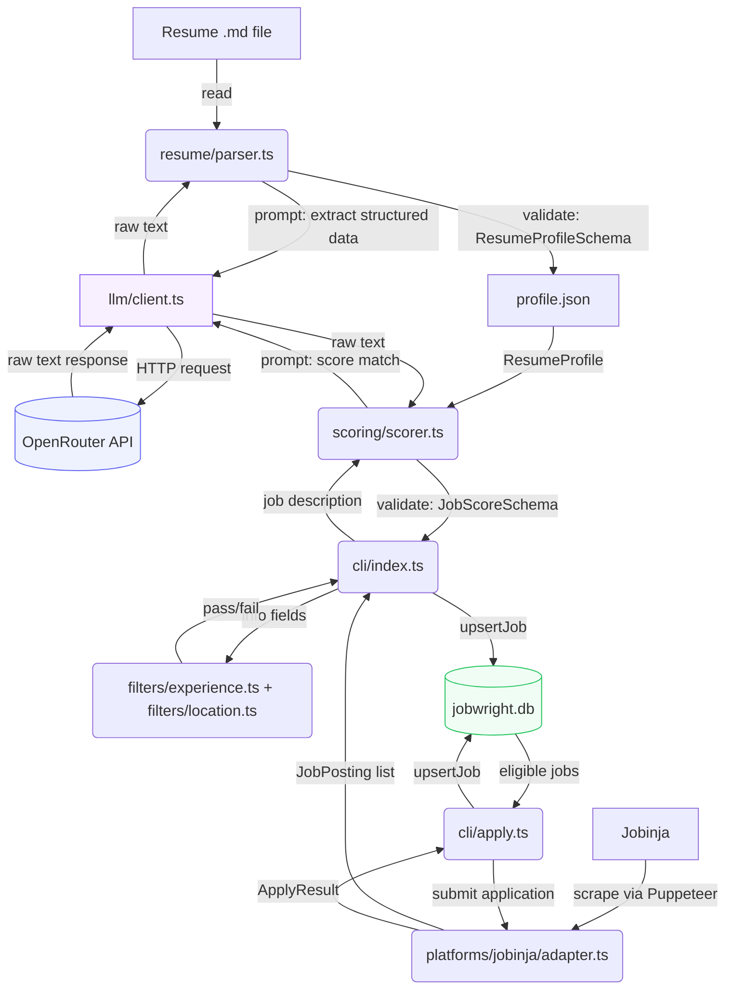

# Jobwright

A self-hosted, open-source CLI tool that parses your resume, matches it against job postings across multiple platforms, and auto-applies to the ones that fit — built for developers who want a real, ownable alternative to manually scrolling job boards.

**Status: V3 — hard filters, auto-apply, and SQLite application tracking.**

## What Jobwright does so far

1. Reads a resume from a local Markdown (`.md`) file
2. Sends it to an LLM (via OpenRouter) to extract structured data — name, skills, work history, city/province, and standalone projects
3. Computes total years of experience and a seniority level from that work history in code (not by the LLM — see note below)
4. Validates the result against a strict schema and saves it to `profile.json`
5. Searches Jobinja for job postings matching a query, using a headless browser
6. Visits each matching posting and extracts its full description and metadata (location, work type, required experience, etc.)
7. **Applies hard filters before scoring:** an opt-in experience filter and an always-on location filter (see Hard Filters below) — jobs that fail a filter are recorded and skipped, saving an LLM call
8. Scores each remaining job posting against your resume using an LLM, producing a 0–100 match score, a count of requirements met vs. total, a list of missing requirements, and a short reasoning summary
9. Records every job the run encounters — filtered, scored, or skipped — to a local SQLite database (`jobwright.db`), replacing the old `jobs.json` file
10. **New in V3:** a separate `apply.ts` entry point reads jobs that scored above threshold straight from the database and submits real applications on Jobinja, recording the outcome (`applied`, `already_applied`, or `error`) back to the same database row

Application outcome tracking beyond apply/already-applied/error (interview stages, responses, rejections) is not implemented yet.

## How it talks to the LLM

Jobwright never lets the LLM touch a browser or make decisions about *what* to do — it's only ever asked to read text and return structured data. Everything else (scraping, filtering, applying, orchestration) is deterministic code.



`llm/client.ts` is a thin, generic wrapper — it knows nothing about resumes or job postings. It takes a finished prompt string and returns whatever text OpenRouter sends back. `resume/parser.ts` and `scoring/scorer.ts` each build their own prompt and are responsible for validating the response against their own schema. The LLM's role is strictly "read this text, extract/judge this specific thing" — never "decide what to do next." Filtering and applying are both fully deterministic — no LLM involvement.

## Hard filters

Applied after scraping, before scoring, so a filtered-out job never costs an LLM call.

**Experience filter** — opt-in via `--experience-tolerance`. With no flag, every job reaches scoring regardless of experience gap. When passed, compares the candidate's `totalYearsExperience` against the job's minimum-experience field with a tolerance buffer (default 1 year). Unparseable experience text always fails open — scoring is the real quality gate, so ambiguous text shouldn't cost a good-fit opportunity. This is deliberately fail-open by default: a strict skip on experience alone would contradict the principle that tech-stack match matters more than years of experience, which the LLM scorer already weighs.

**Location filter** — always active, no opt-in needed. Defaults to permissive province-level matching; `--hard-match` tightens it to exact city-level matching. Remote-tagged jobs always pass regardless of candidate location. Any case where location can't be determined (missing candidate location, missing job field) fails open.

**`--skip-filters`** — bypasses both filters for a single run. Originally added as a debug-only convenience to unblock testing `apply.ts` against a larger job set; kept permanently rather than removed.

## Auto-apply

`cli/apply.ts` is a separate entry point from `cli/index.ts`, run manually after a scoring pass. It queries the database for jobs with `status = 'scored'` at or above `--min-score`, then either logs what it *would* apply to (default, dry run) or submits real applications when `--live-apply` is passed. Every attempt — success, already-applied, or error — is written back to the same database row, so a second run naturally skips anything already handled; there's no separate "check if already applied" step.

## Application tracking (SQLite)

Every job a run touches — filtered out, scored below threshold, scored and eligible, applied to, or errored — is recorded as one row in a local `jobwright.db` SQLite file, keyed by URL. This replaces `jobs.json` and `applyResults.json` entirely; both are gone.

- `src/db/client.ts` opens the database file and creates the `jobs` table if it doesn't exist (WAL mode enabled, for safety if a future daemon/dashboard mode ever reads while a run is writing).
- `src/db/upsertJob.ts` exposes a single `upsertJob()` function — insert-or-update by URL — called from every filter/scoring point in `index.ts` and every apply outcome in `apply.ts`.
- Each row's `status` is one of: `filtered_experience`, `filtered_location`, `scored`, `scored_low`, `applied`, `already_applied`, `error`.
- `src/utils/mapApplyResultToStatus.ts` translates the platform adapter's `ApplyResult["status"]` (`"success" | "alreadyApplied" | "error"`) into the database's `status` values (`"applied" | "already_applied" | "error"`) — the two enums don't share wording, so this is the single place that bridges them.
- A row's `status` reflects only its most recent event — there's no history log of a job passing through multiple states over multiple runs, by design, to keep the schema simple until a real need for history shows up.

## Requirements

- Node.js (v22+ recommended)
- An [OpenRouter](https://openrouter.ai) API key

## Setup

```bash
git clone https://github.com/MB-PieSec/jobwright.git
cd jobwright
npm install
```

Create a `.env` file in the project root with your OpenRouter API key:

```
openRouterAPIKEY=your_key_here
```

`jobwright.db` (plus its `-wal`/`-shm` companion files) is created automatically on first run and should not be committed — add it to `.gitignore`.

## Usage

```bash
npm start
```

On first run, you'll be prompted for the path to your resume (Markdown only for now). The parsed, validated profile is saved to `profile.json` — on subsequent runs this step is skipped if `profile.json` already exists, and the existing profile is loaded and re-validated instead.

The tool then opens a browser, searches Jobinja for a (currently hardcoded) query, filters, scores each matching job against your resume, and records every job to `jobwright.db`.

To apply to eligible jobs, run the separate apply step:

```bash
npx tsx src/cli/apply.ts --live-apply
```

Omit `--live-apply` to dry-run and see what would be applied to without submitting anything.

### CLI flags

All flags accept `--flag=value` or `--flag value` form unless noted otherwise.

| Flag | Default | Used by | Description |
|---|---|---|---|
| `--reasoning-length` | `200` | `index.ts` | Target character length for each job's scoring reasoning |
| `--min-score` | `70` | `index.ts`, `apply.ts` | Score threshold — in `index.ts`, jobs below this are logged as "Ignored"; in `apply.ts`, only jobs at or above this are eligible to apply to |
| `--experience-tolerance` | off (flag absent = no filtering) | `index.ts` | Opt-in experience filter. Presence alone enables it; a value (e.g. `--experience-tolerance=1`) sets the tolerance buffer in years (default `1` if no value given) |
| `--hard-match` | off (boolean) | `index.ts` | Tightens the location filter from province-level to exact city-level matching |
| `--skip-filters` | off (boolean) | `index.ts` | Bypasses both the experience and location filters for the run |
| `--live-apply` | off (boolean) | `apply.ts` | Submits real applications. Without it, `apply.ts` only logs what it would apply to |

## Resume format

Only **Markdown** resumes are supported. PDF and DOCX are not implemented yet. Structure your resume with clear section headers (e.g. `## Experience`, `## Skills`, `## Projects`) — this measurably improves extraction accuracy, since the LLM uses your headers as structural signal. A dedicated `## Projects` section is recommended: entries there are captured separately from work history (see Changelog) and don't need duration information the way work history does.

## Model recommendations

Scoring quality depends heavily on the model you configure in `llm/client.ts`. This isn't a hypothetical — testing surfaced a real difference:

- **`meta-llama/llama-3.1-8b-instruct`** (small, cheap): unreliable. It correctly identified missing requirements in its own reasoning text but frequently ignored that reasoning when picking a score — e.g. scoring a Go-only posting 85/100 for a candidate with zero Go experience.
- **`openai/gpt-4o-mini`**: markedly better. Correctly scored a stack-mismatched .NET posting as 0/100, and after a prompt revision (see V2 changelog), scores now track consistently with the `requirementsMet` / `requirementsTotal` counts returned alongside them (e.g. 3/12 → 25, 6/10 → 60).

**Recommendation:** use a model at least as capable as `gpt-4o-mini` for scoring. Smaller/cheaper models may silently produce unreliable scores — the JSON output will look valid, but the number itself may not reflect the reasoning next to it. Since this tool auto-applies autonomously with no human review step, this matters more than it would for a suggestion-only tool. Always spot-check a batch of results after changing models.

## Known limitations

- **`totalYearsExperience` is computed by summing `durationMonths` across all `workHistory` entries.** Standalone projects are captured separately (see Changelog) and intentionally don't count toward this total, even if resume-worthy.
- Extraction quality depends on the underlying LLM model. Smaller/cheaper models can occasionally misgroup or fragment work history entries — review `profile.json` after running to confirm it looks correct before relying on it downstream.
- Scoring quality also depends on the underlying LLM model — see Model Recommendations above.
- No PDF/DOCX support yet.
- Jobinja search query and platform selection are currently hardcoded in `src/cli/index.ts` — not yet configurable via CLI args or config file.
- **Filtered-out jobs are recorded with a status but no detail beyond that status** — e.g. a `filtered_experience` row doesn't retain the raw experience string that caused the fail. Full audit detail may be added later if needed.
- **No status history.** Each job's database row reflects only its latest state — if a job's status changes across runs (e.g. re-scored after a flag change), the previous state isn't retained, only `updated_at` changes.
- Only Jobinja is supported as a platform so far — the adapter pattern is in place, but no second platform has been implemented yet.
- Jobinja scraping depends on the site's current DOM structure (via `src/platforms/jobinja/selectors.ts`). If Jobinja changes their page layout, extraction may break until selectors are updated.
- **Network routing conflict in sanctioned/restricted regions:** OpenRouter may require a VPN/tunnel to reach (returns `403 Forbidden` otherwise), but scraping Jobinja requires a direct, non-tunneled connection. Running both in the same process currently requires manually toggling your network setup between phases — a per-request proxy scoped to the LLM call, or splitting scraping and scoring into two separate run phases, is planned but not yet implemented.
- No scoring result caching or fuzzy skill matching — scoring is a fresh LLM call per job every run.
- Application outcome tracking beyond apply/already-applied/error (interview stages, responses, rejections) is not implemented yet.

## Project structure

```
src/
├── cli/
│   ├── index.ts                  # entry point — orchestrates resume parsing, job search, filtering, and scoring
│   └── apply.ts                  # reads eligible jobs from jobwright.db, applies, writes outcomes back
├── resume/
│   ├── schema.ts                   # ResumeProfile zod schema (includes city, province, projects)
│   └── parser.ts                   # resume text -> LLM extraction -> validated ResumeProfile
├── scoring/
│   ├── schema.ts                   # JobScore zod schema
│   └── scorer.ts                   # {resumeProfile, jobDescription} -> LLM -> validated JobScore
├── filters/
│   ├── experience.ts                # ExperienceRequirement tagged union, parseExperienceRange, meetsExperienceRequirement
│   └── location.ts                  # meetsLocationRequirement (boolean), uses normalizePersian
├── llm/
│   └── client.ts                    # generic OpenRouter API wrapper — prompt string in, raw text out
├── db/
│   ├── client.ts                    # opens jobwright.db, creates jobs table if missing (WAL mode)
│   └── upsertJob.ts                 # upsertJob() — insert-or-update a job row by URL
├── platforms/
│   ├── types.ts                     # JobListing / JobPosting / JobPlatform contracts (includes apply/ApplyResult)
│   ├── browser.ts                    # shared Puppeteer browser launcher
│   ├── registry.ts                   # platform name -> adapter lookup
│   └── jobinja/
│       ├── adapter.ts                 # implements JobPlatform for Jobinja (search, getJobDetails, apply)
│       └── selectors.ts               # all Jobinja CSS selectors, centralized (listing, detail, apply)
└── utils/
    ├── getUserInput.ts
    ├── readFileContent.ts
    ├── fileExists.ts
    ├── cliFlags.ts                   # getNumericArg(flagName, defaultValue), hasFlag(flagName)
    ├── stripCodeFences.ts            # strips markdown code fences from LLM responses
    ├── normalizePersian.ts           # Persian character-variant + zero-width-char normalization
    └── mapApplyResultToStatus.ts     # ApplyResult status -> database status mapping
└── __tests__/
    └── parser.test.ts
```

## Roadmap

- ~~V0 — resume parsing~~ done
- ~~V1 — first job platform adapter (Jobinja, read-only)~~ done
- ~~V2 — resume-to-job scoring engine~~ done
- ~~V3 — hard filters, auto-apply, SQLite application tracking~~ done
- V4 — additional platforms (Jobvision.ir) + notifications (Telegram/Discord)
- V5 — LinkedIn/Indeed support, richer outcome tracking

## Changelog

### V3
- Added `filters/experience.ts` with a tagged-union `ExperienceRequirement` type (`range`, `atLeast`, `noRequirement`, `fieldAbsent`, `unparseable`) instead of a plain `{min, max}`, so every consumer handles each case explicitly. `noRequirement` and `fieldAbsent` are kept distinct even though they behave identically in the filter, so a future scraper breakage can be told apart from a genuine "doesn't matter" value.
- **Reversed an earlier design decision on the experience filter:** it was initially built as a hard pre-scoring skip (fail on any gap), then reversed after recognizing this contradicted the core principle that tech-stack match matters more than years of experience — a strict skip would silently discard well-matched jobs over a secondary signal the scorer already weighs. Final design is opt-in (`--experience-tolerance`) and fail-open by default; see Hard Filters section above.
- Added `utils/cliFlags.ts`'s `hasFlag(flagName)`, distinguishing "flag absent" from "flag present with a value" — `getNumericArg` alone couldn't express this, which the opt-in experience filter needed.
- Added `filters/location.ts` with `meetsLocationRequirement`, a plain boolean return (unlike the experience filter's tagged union — every "can't determine" case collapses to the same fail-open outcome here, so distinguishing them wasn't needed).
- Added `utils/normalizePersian.ts` to handle Persian/Arabic look-alike character variants (ی vs ي, ک vs ك) and zero-width non-joiners before location comparisons.
- Extended the resume-parsing prompt to extract `city`/`province` in Persian script (even when the resume states location in English), so it can be compared directly against Jobinja's Persian-language location field.
- **Discovered and fixed a real field-format issue:** Jobinja's location field is `<province>, <city>`, not `<city>, <city>` as it first appeared — Tehran and Isfahan looked duplicated only because those cities share their province's name.
- **Discovered that remote status lives in a separate field** (`نوع همکاری` / cooperation type, e.g. `"تمام وقت, دورکاری"`) from location, with an inconsistent delimiter — detection uses a substring check for `"دورکاری"` rather than splitting on a fixed delimiter.
- Added `--hard-match` flag to tighten the location filter from permissive province-level matching to exact city-level matching.
- **Fixed an unrelated regression surfaced while extending the resume prompt:** `workHistory` was silently dropping resume entries under a `## PROJECTS` section, due to a pre-existing prompt rule scoping extraction to work-experience sections only. Fixed by adding a separate `projects` field (`{title, summary}[]`, no `durationMonths`) to `ResumeProfileSchema`, rather than merging into `workHistory`, which would have corrupted the `totalYearsExperience`/`seniorityLevel` math computed from real employment durations.
- Added `apply()` to the `JobPlatform` interface, returning a tagged union `ApplyResult` (`success`, `alreadyApplied`, `error`) instead of a boolean, so each outcome is distinguishable for tracking purposes.
- Implemented `JobinjaAdapter.apply()`. The apply form's phone field and resume-choice radio are both pre-filled/pre-selected automatically by the site, so the implementation only needs to check for an "already applied" indicator, then click submit.
- **Debugged a real submit-confirmation bug:** the first implementation waited in-place for the "already applied" indicator to appear after clicking submit, which timed out — even though the application had actually gone through (confirmed by a second run against the same URL correctly returning `alreadyApplied`). Root cause: clicking submit redirects to a different page, so waiting in-place or reloading checks the wrong page. Fixed by explicitly re-navigating back to the original job URL after the click-triggered navigation completes. Verified end-to-end with a real, successful application, and a second real application to a different posting confirming `apply()` reliably returns `success`.
- Added `cli/apply.ts` as a separate entry point from `cli/index.ts`, deliberately decoupled rather than called inline in the scrape/score loop — this is the first part of the project with real-world side effects, so a persisted checkpoint between scoring and applying gives a review gate before anything irreversible happens.
- Added `--live-apply` flag as a safety gate — without it, `apply.ts` only logs what it would apply to, with zero side effects.
- Added `--skip-filters` flag to `cli/index.ts` to unblock testing `apply.ts` against a larger job set (the always-on location filter alone was leaving too few jobs to test against). Decided to keep it permanently rather than remove it as a debug-only flag.
- **Designed and built the SQLite application tracker**, replacing `jobs.json` and `applyResults.json` entirely:
  - Chose a "wide" schema — one row per job the pipeline ever encounters (filtered, scored, or applied), not just applied ones — over a narrower "applications only" table, in order to fix the audit-trail gap where filtered-out jobs previously left no persisted record at all.
  - Chose `better-sqlite3` (synchronous, raw SQL) over an ORM like Drizzle, for a minimal API with no added abstraction layer.
  - Added `db/client.ts`: opens `jobwright.db`, enables WAL mode, creates the `jobs` table (`url` primary key, `platform`, `title`, `status`, `score`, `reasoning`, `error_reason`, `first_seen_at`, `updated_at`) if it doesn't exist.
  - Added `db/upsertJob.ts`: a single `upsertJob()` function performing `INSERT ... ON CONFLICT(url) DO UPDATE`, called from every filter/scoring decision point in `index.ts` and every apply outcome in `apply.ts`.
  - Accepted a single-status-column design (no separate status-history log) as a deliberate tradeoff — `updated_at` shows when a row last changed, but not its prior states. Full history deferred as unnecessary for now.
  - Added `utils/mapApplyResultToStatus.ts` to translate `ApplyResult["status"]` (`"success" | "alreadyApplied" | "error"`) into the database's `status` values (`"applied" | "already_applied" | "error"`) — the two enums use different wording, so this is the one place that bridges them. Written with no `default` case in its `switch`, so TypeScript raises a compile error if `ApplyResult`'s status type ever grows a new variant without updating the mapping.
  - `cli/index.ts`: `results` array and the final `jobs.json` write removed entirely — every filter/scoring decision now writes directly to the database instead.
  - `cli/apply.ts`: the `jobs.json` file read replaced by a `SELECT` query (`status = 'scored' AND score >= ?`) — filtering out anything already filtered, scored below threshold, or already applied/error'd falls out of the schema for free, with no separate "already applied" check needed. The `applyResults.json` write replaced by an `upsertJob()` call after each `adapter.apply()`.

### V2
- Added `scoring/schema.ts` (`JobScoreSchema`): `score` (0–100, enforced), `requirementsMet` and `requirementsTotal` (both non-negative integers — added specifically to let downstream code sanity-check that a score actually tracks its own stated ratio), `missingRequirements` (string array), `reasoning` (string, length steered by prompt instruction rather than schema-enforced)
- Added `scoring/scorer.ts`: builds a scoring prompt, calls the LLM, strips code fences, validates against `JobScoreSchema`
- **Refactored `llm/client.ts`'s `openRouterWrapper`** from a function that hardcoded the resume-extraction prompt internally into a generic prompt-in/text-out wrapper, so it could be shared by both `resume/parser.ts` and `scoring/scorer.ts` without one feature's prompt leaking into the other's request
- **Moved `stripCodeFences`** out of `resume/parser.ts` into `utils/stripCodeFences.ts` — it's a generic string-cleanup helper with no resume- or scoring-specific knowledge, so it belongs alongside the other shared utilities
- **Iterated on the scoring prompt after finding real inconsistency:** the initial version used abstract anchoring bands (e.g. "missing 1–2 requirements") and produced unreliable scores on a small model, and even on a stronger model, showed a pattern of clustering around round/boundary numbers (e.g. four different postings all scoring exactly 70). Revised the prompt to include explicit step-by-step requirement counting, a worked example, an explicit instruction against defaulting to round numbers, and a formula-first anchor (`score ≈ 100 × requirementsMet / requirementsTotal`, adjustable for severity). Verified against a real batch — scores now track their own `requirementsMet`/`requirementsTotal` consistently.
- Added `utils/cliFlags.ts` with a generalized `getNumericArg(flagName, defaultValue)`, supporting both `--flag=value` and `--flag value` forms, replacing an earlier single-purpose flag parser
- Added `--reasoning-length` and `--min-score` CLI flags (see Usage)
- `cli/index.ts`: profile is now loaded into memory on **both** paths — parsed fresh when `profile.json` doesn't exist, or read from disk and re-validated against `ResumeProfileSchema` when it does. Previously, the "profile already exists" branch didn't actually load anything into memory.
- `cli/index.ts`: jobs with a `null` description (failed/partial scrape) are now skipped from scoring instead of causing a type error
- `cli/index.ts`: every scored job — regardless of score — is now written to `jobs.json` as a flat combined record (job fields + score fields merged). Filtering by score threshold happens only at console-log time for now, not at storage time, since low-scoring jobs may still be useful to review later.
- `cli/index.ts`: added a running `count/total` progress indicator to the console log for each scored job, and jobs below `--min-score` are now explicitly logged as "Ignored" (with their position in the run) instead of being silently skipped from console output
- Moved `parser.test.ts` into a top-level `__tests__/` folder

### V1
- Added `JobListing` / `JobPosting` / `JobPlatform` type contracts (`src/platforms/types.ts`), establishing the adapter interface every platform implements
- Built the Jobinja adapter: search by query, extract job listings, visit each posting and extract full description + metadata
- Centralized all Jobinja CSS selectors into `src/platforms/jobinja/selectors.ts`, threaded through `page.evaluate`/`page.$$eval` browser-context boundaries
- Added `src/platforms/registry.ts` with a strict `PlatformName` union type derived from the registry itself, so adding a platform later doesn't require hand-maintaining a separate type
- Refactored `src/cli/index.ts` to orchestrate through the registry instead of importing a specific adapter directly
- Fixed a logic bug where "Profile already exists!" printed unconditionally regardless of whether a profile was just created
- General hardening pass: replaced `.innerText` with `.textContent` in DOM extraction (more reliable in headless/automated contexts), replaced `||` fallbacks with `??` where appropriate, added explicit `null`/`undefined` handling across extracted fields

### V0
- Initial resume parser: Markdown resume -> LLM extraction (OpenRouter) -> validated JSON
- Defined `ResumeProfileSchema` (zod) as the contract for parsed resume data
- Moved experience-level computation (`totalYearsExperience`, `seniorityLevel`) out of the LLM's responsibility and into deterministic code, after the model proved unreliable at doing the arithmetic itself
- Added `stripCodeFences` to handle models that wrap JSON output in markdown code fences despite instructions not to
- Added unit tests for `computeExperienceLevel` and `stripCodeFences`
- Project scaffolding: TypeScript + `tsx`, Vitest, `.env`-based API key handling

## License

Not yet decided.
