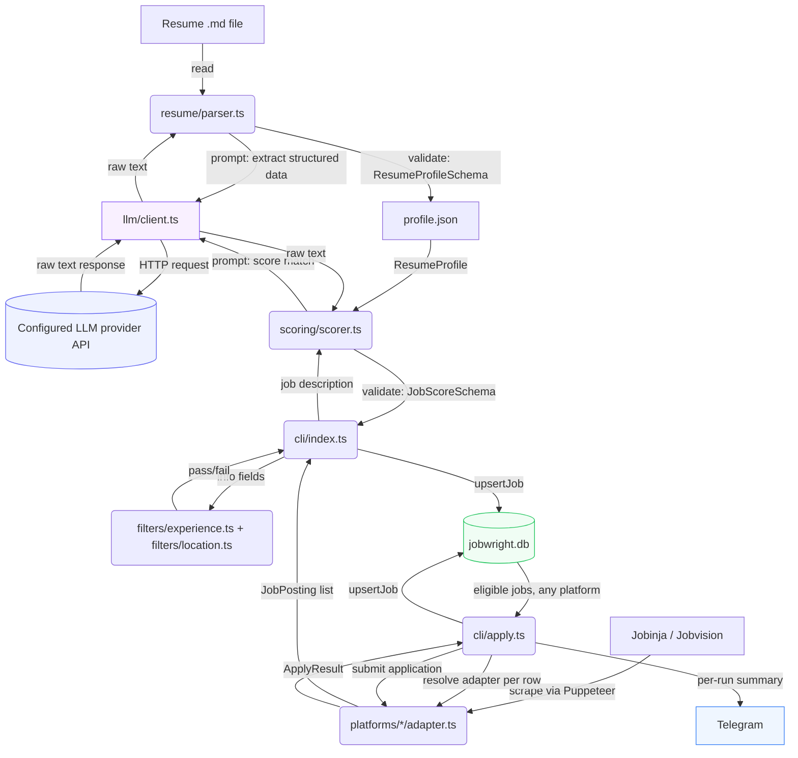

# Jobwright

A self-hosted, open-source job-search tool that parses your resume, matches it against job postings across multiple platforms, and auto-applies to the ones that fit — built for developers who want a real, ownable alternative to manually scrolling job boards. It ships both a CLI and a local web app.

**Status: V5 — bilingual (English/Persian, RTL) web dashboard (Fastify API + React SPA), live run streaming with stop/clear/resume controls, resume upload, browser cookie import, multi-provider AI and Telegram notification settings tabs, plus the V4 pipeline: two job platforms (Jobinja, Jobvision), hard filters, auto-apply, SQLite application tracking, expired-posting detection, error-retry, and Telegram notifications.**

> **⚠️ Use at your own risk.** Jobwright automates scraping and submitting real applications on Jobinja and Jobvision — actions that may fall outside those sites' terms of service. During development and testing, no account used with this tool has been suspended or banned, but that's a small sample over a short period, not a guarantee. This is exactly why Jobwright is self-hosted rather than a shared service: you run it with your own credentials, against your own account, and you carry that risk yourself rather than it being pooled across a userbase. If you're not comfortable with the possibility of your account being flagged, limited, or banned, don't run this against an account you can't afford to lose. Use `--live-apply` deliberately, and consider starting with a small `--max-pages`/dry-run pass before trusting it with a real batch. See [Security, privacy and disclaimers](#security-privacy-and-disclaimers) for the local-only/no-auth model, data handling, and liability terms.

## Security, privacy and disclaimers

**Local-only by default — there is no authentication.** The API and SPA bind to `127.0.0.1` unless you set `HOST`. Every `/api` route is unauthenticated: anything that can reach the port can read your profile and scraped jobs, browse directories through the folder picker, change AI/Telegram settings, start runs, import cookies, or wipe the job database. Do not set `HOST=0.0.0.0`, publish the container port, or put Jobwright behind a reverse proxy without adding authentication and TLS yourself. For remote access, prefer an SSH tunnel to `127.0.0.1:3000`. `CORS_ORIGIN` only limits browser reads; it is not an access control.

**Secrets are stored unencrypted on disk.** AI provider keys and the Telegram bot token live in the local `jobwright.db` `settings` table (or are read from `.env`), and the imported cookie file is written with mode `0600`. The web UI never receives key/token values or cookie values, but a local user who can read those files can. Protect your disk and backups, and revoke keys you no longer use.

**The folder picker can browse the server's filesystem.** `GET /api/fs/list` enumerates any directory the server process can read (directory names and paths only, not file contents). That is required to locate browser profiles, but it is another reason to keep the server on loopback.

**Your resume and job text go to your chosen LLM provider.** Resume parsing and job scoring send the resume, profile, and posting text to whichever provider you configure (OpenRouter, OpenAI, Anthropic, Google Gemini, Groq, DeepSeek, Mistral, xAI, or Together AI). Review that provider's privacy and retention terms before using real personal data. LLM output can be wrong: scores, reasoning, extracted fields, and filter decisions are heuristics, not facts, and should be reviewed. Jobwright does not guarantee that a posting is still open, that a score is fair, or that an application was submitted correctly.

**Auto-apply acts as you.** A live run submits real applications to real employers using your imported session cookies, under your account. You are responsible for every application, its content, timing, and any duplicate or mistaken submissions. Run dry runs first, start with small batches, and keep `--live-apply` deliberate. Automated access may violate a site's terms of service and can lead to rate limits, CAPTCHAs, or account restrictions; the project cannot guarantee otherwise.

**Telegram notifications leave your machine.** When enabled, a per-run summary (counts and duration) is sent through the Telegram Bot API to the configured chat. Treat the bot token as a secret and verify the chat ID before sending a test message.

**Third-party services are independent.** Jobwright is not affiliated with Jobinja, Jobvision, Telegram, or any LLM provider. Their availability, pricing, APIs, and terms can change without notice, and you are responsible for complying with them.

**No warranty; use at your own risk.** Jobwright is provided under the MIT License, without warranty of any kind. To the maximum extent permitted by law, the authors are not liable for account suspensions, missed or duplicate applications, data loss, costs, or other damages arising from use of the tool. See [LICENSE](LICENSE).

## What Jobwright does so far

1. Reads a resume from a local Markdown (`.md`) file
2. Sends it to an LLM (via OpenRouter) to extract structured data — name, skills, work history, city/province, and standalone projects
3. Computes total years of experience and a seniority level from that work history in code (not by the LLM — see note below)
4. Validates the result against a strict schema and saves it to `profile.json`
5. Searches your chosen platform (`--platform`, `jobinja` or `jobvision`) for postings matching a configurable keyword (`--keyword`, default `backend`), paging through up to `--max-pages` pages of results using a headless browser
6. Visits each matching posting and extracts its full description and metadata (location, work type, required experience, etc.)
7. **Applies hard filters before scoring:** an opt-in experience filter and an always-on location filter (see Hard Filters below) — jobs that fail a filter are recorded and skipped, saving an LLM call
8. Scores each remaining job posting against your resume using an LLM, producing a 0–100 match score, a count of requirements met vs. total, a list of missing requirements, and a short reasoning summary
9. Records every job the run encounters — filtered, scored, or skipped — to a local SQLite database (`jobwright.db`)
10. A separate `apply.ts` entry point reads jobs that scored above threshold straight from the database — across **all** platforms in one run, resolving the correct adapter per job — and submits real applications, recording the outcome (`applied`, `already_applied`, `expired`, or `error`) back to the same database row
11. **New in V4:** an optional per-run summary is sent to Telegram after a live apply run (see Notifications below)
12. **New in V5:** a local web app (Fastify API + React SPA) to browse the job database, upload a `.md` resume, start search/apply runs, stream their progress live, and stop/clear/resume them

Application outcome tracking beyond apply/already-applied/expired/error (interview stages, responses, rejections) is not implemented yet.

## Platforms

Jobwright's adapter pattern (`JobPlatform` interface) means every platform implements the same contract — `buildSearchQuery`, `search`, `getJobDetails`, `apply` — but real sites don't always support the same _capabilities_. Right now the two platforms are not at parity:

|                             | Jobinja | Jobvision                                                                                                                                   |
| --------------------------- | ------- | ------------------------------------------------------------------------------------------------------------------------------------------- |
| Search, pagination, scoring | ✅      | ✅                                                                                                                                          |
| Hard filters (location)     | ✅      | ✅ (remote detection via `.feature-tag` chips)                                                                                              |
| Hard filters (experience)   | ✅      | ❌ — no reliable labeled field; Jobvision jobs skip this filter and fail open                                                               |
| Expired-posting detection   | ✅      | ❌ — no confirmed example found yet; an expired Jobvision posting currently reports `alreadyApplied` (false positive) rather than `expired` |
| Live apply (`--live-apply`) | ✅      | ✅                                                                                                                                          |

**Live apply works on both platforms.** Both sites authenticate with the session cookies imported into `cookies.json` (the browser cookie importer reads `jobinja.ir` and `jobvision.ir` together), so a live run can apply on either platform without a separate login step. Search, scoring, and filtering also work fully unauthenticated; only `apply()` needs the cookies. If the imported session is missing or expired, `apply.ts` surfaces a clear `error` for that job rather than silently failing — re-import the cookies from a logged-in browser profile and retry.

## How it talks to the LLM

Jobwright never lets the LLM touch a browser or make decisions about _what_ to do — it's only ever asked to read text and return structured data. Everything else (scraping, filtering, applying, orchestration) is deterministic code.


```mermaid
flowchart TD
    A[Resume .md file] -->|read| B(resume/parser.ts)
    B -->|"prompt: extract structured data"| C[llm/client.ts]
    C -->|HTTP request| D[(Configured LLM provider API)]
    D -->|raw text response| C
    C -->|raw text| B
    B -->|validate: ResumeProfileSchema| E[profile.json]

    F[Jobinja / Jobvision] -->|scrape via Puppeteer| G(platforms/*/adapter.ts)
    G -->|JobPosting list| H(cli/index.ts)

    H -->|"info fields"| K(filters/experience.ts + filters/location.ts)
    K -->|pass/fail| H

    E -->|ResumeProfile| I(scoring/scorer.ts)
    H -->|"job description"| I
    I -->|"prompt: score match"| C
    C -->|raw text| I
    I -->|validate: JobScoreSchema| H
    H -->|upsertJob| L[(jobwright.db)]

    L -->|eligible jobs, any platform| M(cli/apply.ts)
    M -->|resolve adapter per row| G
    M -->|submit application| G
    G -->|ApplyResult| M
    M -->|upsertJob| L
    M -->|per-run summary| N[Telegram]

    style C fill:#f9f0ff,stroke:#8b5cf6
    style D fill:#eef2ff,stroke:#6366f1
    style L fill:#f0fdf4,stroke:#22c55e
    style N fill:#eff6ff,stroke:#3b82f6
```

`llm/client.ts` is a thin, generic wrapper — it knows nothing about resumes or job postings. It takes a finished prompt string and returns whatever text the configured provider sends back, handling the OpenAI-compatible, Anthropic Messages, and Gemini `generateContent` request shapes behind one `complete()` function. `llm/config.ts` resolves which provider, model, and key to use (a key saved in the web UI wins over an environment variable), and `llm/providers.ts` is the catalog of supported services. `resume/parser.ts` and `scoring/scorer.ts` each build their own prompt and are responsible for validating the response against their own schema. The LLM's role is strictly "read this text, extract/judge this specific thing" — never "decide what to do next." Filtering and applying are both fully deterministic — no LLM involvement.

## Hard filters

Applied after scraping, before scoring, so a filtered-out job never costs an LLM call.

**Experience filter** — opt-in via `--experience-tolerance`, Jobinja only (see Platforms above). With no flag, every job reaches scoring regardless of experience gap. When passed, compares the candidate's `totalYearsExperience` against the job's minimum-experience field with a tolerance buffer (default 1 year). Unparseable experience text always fails open — scoring is the real quality gate, so ambiguous text shouldn't cost a good-fit opportunity. This is deliberately fail-open by default: a strict skip on experience alone would contradict the principle that tech-stack match matters more than years of experience, which the LLM scorer already weighs.

**Location filter** — always active, no opt-in needed, works on both platforms. Defaults to permissive province-level matching; `--hard-match` tightens it to exact city-level matching. Remote-tagged jobs always pass regardless of candidate location — on Jobinja this comes from the `نوع همکاری` field, on Jobvision from `.feature-tag` chips (there can be more than one; only the remote-indicating tag matters). Any case where location can't be determined (missing candidate location, missing job field) fails open.

**`--skip-filters`** — bypasses both filters for a single run. Originally added as a debug-only convenience to unblock testing `apply.ts` against a larger job set; kept permanently rather than removed.

## Auto-apply

`cli/apply.ts` is a separate entry point from `cli/index.ts`, run manually after one or more scoring passes. It queries the database for jobs with `status = 'scored'` at or above `--min-score`, **across every platform present in the database in one run** — for each eligible job it resolves the correct adapter from the row's own `platform` column, rather than requiring you to specify which platform to apply on. It either logs what it _would_ apply to (default, dry run) or submits real applications when `--live-apply` is passed. Every attempt — success, already-applied, expired, or error — is written back to the same database row, so a second run naturally skips anything already handled; there's no separate "check if already applied" step. A failure on one job (network error, adapter crash, unknown platform) is recorded as `error` and the run continues with the next job rather than aborting the whole batch. `--max-applies` caps the number of applications in a single run.

**`--retry-errors`** — by default, a row that ends in `status = 'error'` is never retried automatically (an `expired` posting never should be retried, but a transient network error might be worth another attempt). Passing this flag additionally includes `error` rows in the eligible set for that run, alongside `scored` ones. `expired` rows are never included, retry flag or not.

## Notifications

After a **live** (`--live-apply`) run finishes, `apply.ts` sends a one-message summary — counts of applied / already-applied / expired / errored, plus run duration — to any configured notification channel. Dry runs never notify.

Channels implement a small `NotificationChannel` interface (`notifications/types.ts`) so adding a new one (SMS, email, Discord) means writing one class and registering it — no changes needed in `apply.ts` itself:

- `notifications/telegram.ts` — the only channel implemented so far. Posts to a Telegram chat via the Bot API.
- `notifications/config.ts` — resolves the bot token and chat ID from saved settings first, then `.env`; exposes presence-only state to the web UI.
- `notifications/registry.ts` — builds the active channel list from whichever channels have complete config; channels with missing config are simply skipped.
- `notifications/notifyAll.ts` — sends to every active channel via `Promise.allSettled`; a failure in one channel (or all of them) is logged and never blocks or fails the apply run itself — notifications are deliberately decoupled from the real work.

**Telegram setup:** create a bot via [@BotFather](https://t.me/BotFather), get its token, message the bot once (or add it to a channel as admin), then call `https://api.telegram.org/bot<token>/getUpdates` to read back the `chat.id` to notify. Configure both in the **Notifications** tab (`#/notifications`), which stores them in the local `settings` table and offers a **Send test message** button. The page never receives the saved token back — only whether one is saved and whether it came from the UI or the environment.

You can also set them in `.env`; saved values win, so a stale environment token can be replaced without a restart:

```
TELEGRAM_BOT_TOKEN=your_bot_token_here
TELEGRAM_CHAT_ID=your_chat_id_here
```

If neither source is configured, Telegram notifications are simply not sent — no error, no crash.

## Application tracking (SQLite)

Every job a run touches — filtered out, scored below threshold, scored and eligible, applied to, expired, or errored — is recorded as one row in a local `jobwright.db` SQLite file, keyed by URL.

- `src/db/client.ts` opens the database file and creates the `jobs` table if it doesn't exist (WAL mode enabled, for safety if a future daemon/dashboard mode ever reads while a run is writing).
- `src/db/upsertJob.ts` exposes a single `upsertJob()` function — insert-or-update by URL — called from every filter/scoring point in `index.ts` and every apply outcome in `apply.ts`.
- `src/db/getEligibleJobs.ts` — `getEligibleJobs(minScore, retryErrors)` returns eligible rows (including their `platform`) across all platforms in one query.
- Each row's `status` is one of: `filtered_experience`, `filtered_location`, `scored`, `scored_low`, `applied`, `already_applied`, `expired`, `error`.
- `src/utils/mapApplyResultToStatus.ts` translates the platform adapter's `ApplyResult["status"]` into the database's `status` values — written with no `default` case in its `switch`, so TypeScript raises a compile error if `ApplyResult` ever grows a new variant without updating the mapping (this caught the `expired` addition automatically).
- A row's `status` reflects only its most recent event — there's no history log of a job passing through multiple states over multiple runs, by design, to keep the schema simple until a real need for history shows up.
- `src/db/check.js` / `src/db/reset.js` — small dev-utility scripts (plain Node, ES modules) for inspecting and manually resetting job statuses during development. Not part of the shipped pipeline, but kept in the repo since this is open source and other contributors may find them useful for their own debugging.
- A separate `runs` table tracks API-triggered runs (`kind`, `status`, `params`, `result`, `events`, timestamps). Runs are serialized, events are streamed live over SSE and persisted when the run finishes, and anything left `queued`/`running` from a previous process is marked `failed` on startup.

## Requirements

- Node.js (v22+ recommended)
- An API key for one supported LLM provider. [OpenRouter](https://openrouter.ai) is the default and gives one key access to many models; direct OpenAI, Anthropic (Claude), Google Gemini, Groq, DeepSeek, Mistral, xAI (Grok), and Together AI keys also work.

## Setup

```bash
git clone https://github.com/MB-PieSec/jobwright.git
cd jobwright
npm install
```

Create a `.env` file in the project root (or copy `.env.example`):

```bash
cp .env.example .env
```

```
openRouterAPIKEY=your_key_here

# Optional
OPENROUTER_MODEL=openai/gpt-4o-mini
JOBWRIGHT_COOKIES_PATH=./cookies.json
JOBWRIGHT_DB_PATH=./jobwright.db
TELEGRAM_BOT_TOKEN=your_bot_token_here
TELEGRAM_CHAT_ID=your_chat_id_here
```

Only one provider key is required. `TELEGRAM_*` is optional — omit it to run without notifications. `OPENROUTER_MODEL` defaults to `openai/gpt-4o-mini`.

Keys can also be pasted in the web app's **AI providers** tab, which tests the connection before saving. A key saved there takes precedence over the matching environment variable, so you can replace a stale key without editing `.env` or restarting the server. Supported environment variables: `openRouterAPIKEY` / `OPENROUTER_API_KEY`, `OPENAI_API_KEY`, `ANTHROPIC_API_KEY`, `GEMINI_API_KEY` / `GOOGLE_API_KEY`, `GROQ_API_KEY`, `DEEPSEEK_API_KEY`, `MISTRAL_API_KEY`, `XAI_API_KEY`, and `TOGETHER_API_KEY`. See `.env.example` for the full list.

`jobwright.db` (plus its `-wal`/`-shm` companion files) is created automatically on first run and is already gitignored.

**Cookies:** `cookies.json` in the project root holds session cookies Puppeteer loads before every run. Both platforms authenticate this way, so importing your logged-in Jobinja and Jobvision session cookies into this file (as a flat array of Puppeteer-format cookie objects) is enough for `apply()` to work on either site. Cookies for multiple sites coexist in the same file — each cookie object carries its own `domain`, so Puppeteer applies them correctly regardless of how many domains are mixed into the array. The web UI's **Settings → Cookie import** writes both domains for you.

> **These cookies are live credentials.** `cookies.json` is gitignored on purpose — never commit it, and never paste its contents into an issue or chat. If it ever lands in git (or gets shared), log out of the affected account to invalidate the session, then rotate the file. Set `JOBWRIGHT_COOKIES_PATH` if you want to keep it somewhere outside the repo. Upgrading from an older version? Move `src/config/cookies.json` to `./cookies.json` — that path is no longer read.

## Usage

```bash
npm start
```

On first run, you'll be prompted for the path to your resume (Markdown only for now). The parsed, validated profile is saved to `profile.json` — on subsequent runs this step is skipped if `profile.json` already exists, and the existing profile is loaded and re-validated instead.

The tool then opens a browser, searches your chosen platform (`--platform`, default `jobinja`) for the configured keyword (`--keyword`, default `backend`), fetching up to `--max-pages` pages of results (default `3`) — the console log tells you the total number of matching jobs found and how many pages you're covering, so you know if you're leaving results on the table. It then filters, scores each matching job against your resume, and records every job to `jobwright.db`.

To search Jobvision instead (or in addition — run both, they land in the same database):

```bash
npx tsx src/cli/index.ts --platform=jobvision
```

To apply to eligible jobs across whichever platforms you've scraped:

```bash
npx tsx src/cli/apply.ts --live-apply
```

Omit `--live-apply` to dry-run and see what would be applied to without submitting anything. `apply.ts` does not take a `--platform` flag — it resolves the right adapter per job automatically.

### CLI flags

All flags accept `--flag=value` or `--flag value` form unless noted otherwise.

| Flag                     | Default                          | Used by                | Description                                                                                                                                                                     |
| ------------------------ | -------------------------------- | ---------------------- | ------------------------------------------------------------------------------------------------------------------------------------------------------------------------------- |
| `--platform`             | `jobinja`                        | `index.ts`             | Which platform to search — `jobinja` or `jobvision`. Validated against the platform registry; an unknown value exits with a clear error rather than crashing later              |
| `--reasoning-length`     | `200`                            | `index.ts`             | Target character length for each job's scoring reasoning                                                                                                                        |
| `--min-score`            | `70`                             | `index.ts`, `apply.ts` | Score threshold — in `index.ts`, jobs below this are logged as "Ignored"; in `apply.ts`, only jobs at or above this are eligible to apply to                                    |
| `--keyword`              | `backend`                        | `index.ts`             | Search keyword sent to the chosen platform. Only a single keyword is supported per run (see Known Limitations)                                                                  |
| `--max-pages`            | `3`                              | `index.ts`             | Maximum number of search-result pages to scrape. If the site reports more results than this covers, a console log tells you how many pages/jobs you're missing                  |
| `--experience-tolerance` | off (flag absent = no filtering) | `index.ts`             | Opt-in experience filter, Jobinja only. Presence alone enables it; a value (e.g. `--experience-tolerance=1`) sets the tolerance buffer in years (default `1` if no value given) |
| `--hard-match`           | off (boolean)                    | `index.ts`             | Tightens the location filter from province-level to exact city-level matching                                                                                                   |
| `--skip-filters`         | off (boolean)                    | `index.ts`             | Bypasses both the experience and location filters for the run                                                                                                                   |
| `--live-apply`           | off (boolean)                    | `apply.ts`             | Submits real applications. Without it, `apply.ts` only logs what it would apply to                                                                                              |
| `--retry-errors`         | off (boolean)                    | `apply.ts`             | Also retries jobs currently at `status = 'error'`, alongside normal `scored` jobs. Never retries `expired` jobs                                                                 |
| `--max-applies`          | `0` (no cap)                     | `apply.ts`             | Cap how many jobs a single run will apply to, e.g. `--max-applies=10`. Cheap insurance for an irreversible action                                                               |

## Web app

Jobwright ships a local web app: a Fastify API plus a React SPA. The actual work lives in `src/pipeline/` and is shared by both entry points — `cli/index.ts` and `cli/apply.ts` are thin wrappers that parse flags and subscribe to the same typed events with a console listener. That keeps terminal output unchanged while letting the server drive the same runs.

```bash
npm run dev:server      # tsx watch
# or
npm run start:server
```

The API listens on `127.0.0.1:3000` by default (`HOST` / `PORT` override this). CORS allows `http://localhost:5173` by default (`CORS_ORIGIN`, comma-separated). If a built SPA exists at `web/dist`, it is served statically and non-`/api` GETs fall back to `index.html`.

The app is loopback-only and has no authentication. Anyone who can reach the port can browse the server's filesystem through the folder picker and trigger real apply runs, so keep it bound to localhost.

### Endpoints

| Method | Path                     | Purpose                                                                                               |
| ------ | ------------------------ | ----------------------------------------------------------------------------------------------------- |
| GET    | `/api/health`            | Liveness check                                                                                        |
| GET    | `/api/profile`           | Parsed profile from `profile.json` (404 if absent)                                                    |
| GET    | `/api/jobs`              | Filter/sort/paginate jobs                                                                             |
| GET    | `/api/jobs/:id`          | One job                                                                                               |
| DELETE | `/api/jobs/:id`          | Delete one job                                                                                        |
| DELETE | `/api/jobs?confirm=yes`  | Wipe all jobs                                                                                         |
| GET    | `/api/stats`             | Dashboard aggregates: status/platform counts, score buckets, 14-day activity, run counts, recent runs |
| POST   | `/api/runs`              | Queue a search or apply run                                                                           |
| GET    | `/api/runs`              | List runs                                                                                             |
| GET    | `/api/runs/:id`          | Run status + result                                                                                   |
| POST   | `/api/runs/:id/stop`     | Stop a queued/running run (marks it `cancelled`)                                                      |
| POST   | `/api/runs/:id/resume`   | Re-queue a stopped search run, skipping jobs it already processed                                     |
| GET    | `/api/runs/:id/events`   | SSE stream of run events                                                                              |
| GET    | `/api/resume`            | Active profile, upload metadata, profile mtime, supported extensions                                  |
| POST   | `/api/resume`            | Upload and parse a Markdown resume (`.md`, max 256 KiB)                                               |
| GET    | `/api/ai`                | Active provider/model, key source per provider (never key values)                                     |
| PUT    | `/api/ai`                | Save the active provider/model and optionally a key                                                   |
| POST   | `/api/ai/test`           | Test a provider/model/key without saving it                                                           |
| DELETE | `/api/ai/keys/:provider` | Remove the saved key for one provider                                                                 |
| GET    | `/api/settings`          | Cookie source, auto-import flag, last import, cookie file path                                        |
| PUT    | `/api/settings`          | Update the saved cookie source and auto-import flag                                                   |
| GET    | `/api/cookies/browsers`  | Detected Brave/Chrome/Opera/Firefox installs and profiles                                             |
| POST   | `/api/cookies/import`    | Import jobinja.ir/jobvision.ir cookies from a browser profile                                         |
| GET    | `/api/fs/roots`          | Home, filesystem root, and known browser data folders                                                 |
| GET    | `/api/fs/list?path=`     | List subdirectories for the server-side folder picker                                                 |

`/api/fs/list` returns directory metadata only (`name`, `path`, `isBrowserRoot`, `hasCookies`) — never file contents. It exists because a browser page cannot read the server's filesystem; it is used when a browser is installed somewhere the detector does not know about.

Start a search run:

```bash
curl -X POST localhost:3000/api/runs -H 'content-type: application/json' -d '{
  "kind": "search",
  "platform": "jobinja",
  "keyword": "backend",
  "maxPages": 3,
  "minScore": 70
}'
```

Start an apply run (dry run by default; `liveApply: true` submits real applications):

```bash
curl -X POST localhost:3000/api/runs -H 'content-type: application/json' -d '{
  "kind": "apply",
  "liveApply": false,
  "jobIds": [12, 34]
}'
```

`POST /api/runs` returns `202 { runId, status: "queued" }`. Runs are serialized — one at a time — because they share a Puppeteer browser and mutate the same database. `GET /api/runs/:id/events` replays past events and then streams live ones; reconnect with `Last-Event-ID` to resume. Dry-run apply does not launch a browser. Live apply still sends the Telegram summary.

`POST /api/runs/:id/stop` sets a queued run to `cancelled` immediately. A running pipeline is aborted at its next safe boundary — before launching the browser and between jobs — so the job in flight is allowed to finish and the run is never left half-recorded. The event stream emits `run_cancelled`, and the UI shows a **Stopped** badge with **Clear** and **Resume** actions.

`POST /api/runs/:id/resume` is available only for stopped search runs. It creates a new run with the original stored parameters, emits `run_resumed { fromRunId }`, and skips every job URL the stopped run already processed (read back from its persisted events) so scoring calls are not repeated. Clear is a UI-only action: it hides the log without deleting the run row or its events.

Upload a Markdown resume:

```bash
curl -X POST localhost:3000/api/resume -H 'content-type: application/json' -d '{
  "filename": "resume.md",
  "content": "# Your Name\n\n## Experience\n..."
}'
```

The server validates the extension and size, parses the text through the same LLM pipeline as the CLI, writes `profile.json`, and keeps the original Markdown at `resume.md` (`JOBWRIGHT_RESUME_PATH` overrides the path; `JOBWRIGHT_PROFILE_PATH` overrides the profile path). Parsing happens before either file is written, so a failed LLM call leaves the previous resume and profile intact. The original filename is display metadata only — the server stores the basename and never uses it as a write path.

The resume parser and job scorer both use the active AI provider saved through `PUT /api/ai` (or the first provider with an environment key when nothing is saved). `GET /api/ai` reports only key presence and source — `saved`, `environment`, or `null` — and never returns a key value. `POST /api/ai/test` performs a tiny round-trip against the provider and returns the latency and a short reply; the web UI calls it before saving so a bad key is rejected instead of stored.

Telegram notifications follow the same pattern: `GET /api/notifications` returns the resolved chat ID and whether each credential came from saved settings or the environment, never the token; `PUT /api/notifications` saves or clears (`null`) either value; `POST /api/notifications/test` sends a test message without saving; and `DELETE /api/notifications/telegram` removes both saved values so `.env` takes over again.

When auto-import is enabled in Settings, a live apply run refreshes cookies from the saved browser profile before it starts. An import failure is logged and the run continues with the existing `cookies.json`, so a stale or moved browser profile never blocks a run outright.

`jobIds` narrows the eligible set; it does not override eligibility — rows must still be `status = 'scored'` (or `error` when `retryErrors` is true) and meet `minScore`. Pass `jobIds: []` to explicitly select nothing.

Array query params on `/api/jobs` use repeated keys (`?status=scored&status=error`), not bracket syntax.

### Web UI

`web/` is a React + Vite + TypeScript SPA served by Fastify. A hamburger button opens a slide-over navigation drawer with seven hash routes (no server route config needed):

- **Overview** (`#/overview`, default) — the landing dashboard. Stat cards for total jobs, applied, average score and completed runs; hand-built SVG donut charts for status and platform splits; a stacked 14-day activity chart of jobs seen vs. applied; a score-distribution chart in ten-point buckets; and a recent-runs list.
- **Jobs** (`#/jobs`) — the review table: sticky filter bar (search, status multi-select, platform chips, score range, date range, sort), dense table that collapses to cards on mobile, pagination, and a right-side detail panel with the LLM reasoning and a delete action.
- **Runs** (`#/runs`) — search and apply forms, run history, and a live SSE log panel. Live apply requires typing `APPLY` in a confirmation dialog before it will queue. Active runs show **Stop**; stopped search runs show **Clear** and **Resume**.
- **Resume** (`#/resume`) — drag-and-drop or pick a `.md` resume, upload it for LLM parsing, and inspect the active profile (skills, experience, projects, education) with its upload metadata.
- **AI providers** (`#/ai`) — pick OpenRouter, OpenAI, Anthropic (Claude), Google Gemini, Groq, DeepSeek, Mistral, xAI (Grok), or Together AI; edit the model with per-provider suggestions; paste a key; and run **Test connection & save**. Keys are stored locally in SQLite and only their presence/source is ever sent back to the page.
- **Notifications** (`#/notifications`) — configure the Telegram bot token and chat ID, send a test message, and remove saved settings. Values saved here override `.env`; the token is stored locally and never returned to the browser.
- **Settings** (`#/settings`) — browser detection, profile selection, cookie import, the auto-import toggle, last-import status, and the server-side folder picker.

Charts are hand-written SVG/CSS with no chart library, and the SPA has no component library. Tailwind CSS v4 is configured CSS-first in `web/src/index.css` (`@theme` tokens, class-based dark mode, indigo→violet→rose accent gradients). A language button in the top bar switches the whole UI between English and Persian/RTL; the choice is saved in `localStorage` and dates/numbers use `Intl` with `en-US` or `fa-IR`. See [`web/README.md`](web/README.md) for the design-token, dark-mode, gradient and RTL conventions.

#### Cookie import

Settings detects Brave, Chrome, Opera and Firefox and lists their profiles. **Linux is the fully supported platform today** (Windows next, then macOS). Chromium-family cookies are decrypted with the key from the desktop keyring (libsecret, via `secret-tool` or PyGObject) and the standard PBKDF2/AES-128-CBC scheme, including the `SHA256(host_key)` prefix newer builds prepend. Firefox cookies come from its plaintext `cookies.sqlite`.

Only `jobinja.ir` and `jobvision.ir` cookies are read. They are written as Puppeteer-format JSON to `cookies.json` (or `JOBWRIGHT_COOKIES_PATH`) with mode `0600`; cookie values are never returned to the browser. Treat that file as a credential: those session cookies can sign in as you until they expire or you sign out. If a browser is installed somewhere the detector does not know about, **Browse…** opens a server-backed folder picker (`/api/fs/roots` + `/api/fs/list`) so you can point at the installation or profile folder yourself.

```bash
# Development — API and Vite run separately; /api is proxied to :3000
npm run dev:server
npm run dev:web

# Production — build once, then let Fastify serve web/dist
npm run build:web
npm run start:server
```

## Resume format

Only **Markdown** resumes are supported. PDF and DOCX are not implemented yet. Structure your resume with clear section headers (e.g. `## Experience`, `## Skills`, `## Projects`) — this measurably improves extraction accuracy, since the LLM uses your headers as structural signal. A dedicated `## Projects` section is recommended: entries there are captured separately from work history (see Changelog) and don't need duration information the way work history does.

You can create the profile either from the CLI (point it at the file on first run) or from the web app's **Resume** tab. Uploads accept `.md` / `.MD` up to 256 KiB, are parsed with the same LLM prompt as the CLI, and replace both `resume.md` (the original) and `profile.json` (the parsed result). Other formats are planned but not implemented.

## Model recommendations

Scoring quality depends heavily on the model you configure in the **AI providers** tab (or the matching `*_MODEL` environment variable). This isn't a hypothetical — testing surfaced a real difference:

- **`meta-llama/llama-3.1-8b-instruct`** (small, cheap): unreliable. It correctly identified missing requirements in its own reasoning text but frequently ignored that reasoning when picking a score — e.g. scoring a Go-only posting 85/100 for a candidate with zero Go experience.
- **`openai/gpt-4o-mini`**: markedly better. Correctly scored a stack-mismatched .NET posting as 0/100, and after a prompt revision (see V2 changelog), scores now track consistently with the `requirementsMet` / `requirementsTotal` counts returned alongside them (e.g. 3/12 → 25, 6/10 → 60).

**Recommendation:** use a model at least as capable as `gpt-4o-mini` for scoring. Smaller/cheaper models may silently produce unreliable scores — the JSON output will look valid, but the number itself may not reflect the reasoning next to it. Since this tool auto-applies autonomously with no human review step, this matters more than it would for a suggestion-only tool. Always spot-check a batch of results after changing models.

## Known limitations

- **`totalYearsExperience` is computed by summing `durationMonths` across all `workHistory` entries.** Standalone projects are captured separately (see Changelog) and intentionally don't count toward this total, even if resume-worthy.
- Extraction quality depends on the underlying LLM model. Smaller/cheaper models can occasionally misgroup or fragment work history entries — review `profile.json` after running to confirm it looks correct before relying on it downstream.
- Scoring quality also depends on the underlying LLM model — see Model Recommendations above.
- No PDF/DOCX support yet.
- The search keyword is configurable (`--keyword`), but only a single keyword is supported per run — no multi-keyword search in one invocation. This is a deliberate constraint, not a gap: unioning results across multiple keyword searches would multiply LLM scoring calls (and cost) for jobs that may overlap across searches, and would need dedup logic that doesn't exist yet.
- **Jobvision has no experience-filter data.** There's no reliably labeled experience field on Jobvision postings (it appears, when present at all, as an unlabeled bullet mixed into free-text "key indicator" items) — Jobvision jobs currently skip the experience filter entirely (fail open) rather than a heuristic bullet-parser built on too few real examples.
- **Jobvision has no expired-posting detection.** No confirmed example of an expired Jobvision posting has been found yet to build a selector against. Until then, an expired Jobvision job will likely be misreported as `alreadyApplied` (a false positive) rather than `expired`, since detection there is based on the submit button's absence.
- **Filtered-out jobs are recorded with a status but no detail beyond that status** — e.g. a `filtered_experience` row doesn't retain the raw experience string that caused the fail. Full audit detail may be added later if needed.
- **No status history.** Each job's database row reflects only its latest state — if a job's status changes across runs (e.g. re-scored after a flag change, or retried after an error), the previous state isn't retained, only `updated_at` changes.
- Scraping depends on each site's current DOM structure (`src/platforms/*/selectors.ts`). If either site changes its page layout, extraction may break until selectors are updated. This has already happened once within Jobvision's own markup — some postings wrap their description text differently (with or without a `dir`-attributed wrapper div) depending on the posting, not just by language, and the selector had to be widened to tolerate both shapes.
- **Network routing in sanctioned/restricted regions:** OpenRouter may be unreachable without a VPN/tunnel (returns `403 Forbidden` otherwise), while scraping either job site works best with a direct connection. This isn't solved at the application level — Jobwright makes no attempt to switch network paths mid-run. The practical fix is at your VPN/network layer: configure your VPN client or server to route domestic traffic direct while tunneling everything else, so both connections work transparently without the app needing to know the difference.
- No scoring result caching or fuzzy skill matching — scoring is a fresh LLM call per job every run.
- Only Telegram is implemented as a notification channel so far, and only a per-run summary (no per-job messages).
- Application outcome tracking beyond apply/already-applied/expired/error (interview stages, responses, rejections) is not implemented yet.

## Project structure

```
src/
├── cli/
│   ├── index.ts                  # thin wrapper — parse flags, load profile, run the search pipeline
│   ├── apply.ts                  # thin wrapper — parse flags, run the apply pipeline
│   └── consoleListener.ts        # pipeline events -> the original terminal output format
├── pipeline/
│   ├── types.ts                  # SearchOptions/ApplyOptions, PipelineEvent, result summaries
│   ├── cancel.ts                 # RunCancelledError + throwIfAborted for cooperative cancellation
│   ├── runSearch.ts              # scrape -> filter -> score -> record, emits progress events
│   └── runApply.ts               # eligibility -> apply -> record -> notify, emits progress events
├── resume/
│   ├── schema.ts                   # ResumeProfile zod schema (includes city, province, projects)
│   ├── parser.ts                   # resume text -> LLM extraction -> validated ResumeProfile
│   ├── loadProfile.ts              # load/re-validate profile.json (interactive CLI or non-interactive server)
│   └── upload.ts                   # validate/save web uploads: .md only, 256 KiB, atomic profile write
├── server/
│   ├── index.ts                    # Fastify app — CORS, error handling, static SPA, route registration
│   ├── plugins/
│   │   └── db.ts                   # decorates the Fastify instance with the shared SQLite connection
│   ├── routes/
│   │   ├── jobs.ts                 # GET/DELETE /api/jobs (filter, sort, paginate, wipe)
│   │   ├── job.ts                  # GET/DELETE /api/jobs/:id
│   │   ├── runs.ts                 # POST/GET /api/runs, stop/resume, SSE stream, auto-import hook
│   │   ├── profile.ts              # GET /api/profile
│   │   ├── resume.ts               # GET/POST /api/resume — profile metadata + Markdown upload/parse
│   │   ├── ai.ts                   # GET/PUT /api/ai, POST /api/ai/test, DELETE /api/ai/keys/:provider
│   │   ├── notifications.ts        # GET/PUT /api/notifications, POST /test, DELETE /telegram
│   │   ├── stats.ts                # GET /api/stats — dashboard aggregates + 14-day activity
│   │   ├── settings.ts             # GET/PUT /api/settings — cookie source + auto-import
│   │   ├── cookies.ts              # GET /api/cookies/browsers, POST /api/cookies/import
│   │   └── fs.ts                   # GET /api/fs/roots, GET /api/fs/list — folder picker
│   └── runs/
│       ├── manager.ts              # serialized run queue, cancellation registry, events, DB persistence
│       └── resume.ts               # processedJobUrls() — URLs a stopped run already handled
├── cookies/
│   ├── types.ts                    # BrowserId, DetectedBrowser, CookieImportResult, CookieSource
│   ├── definitions.ts              # per-browser/OS install and profile locations
│   ├── detect.ts                   # finds installed browsers and profiles
│   ├── domains.ts                  # jobinja.ir / jobvision.ir host filtering
│   ├── keyring.ts                  # libsecret key lookup (secret-tool, PyGObject fallback)
│   ├── chromium.ts                 # Chromium key derivation, AES decryption, row mapping
│   ├── firefox.ts                  # plaintext cookies.sqlite reader
│   └── import.ts                   # profile resolution, 0600 cookie write, auto-import
├── jobs/
│   └── statuses.ts                 # canonical job status list shared by API + stats
├── settings/
│   └── store.ts                    # JSON key/value rows in the settings table
├── scoring/
│   ├── schema.ts                   # JobScore zod schema
│   └── scorer.ts                   # {resumeProfile, jobDescription} -> LLM -> validated JobScore
├── filters/
│   ├── experience.ts                # ExperienceRequirement tagged union, parseExperienceRange, meetsExperienceRequirement
│   └── location.ts                  # meetsLocationRequirement (boolean), uses normalizePersian
├── llm/
│   ├── providers.ts                 # catalog: endpoints, env keys, default models, docs for 9 providers
│   ├── config.ts                    # active provider/model resolution, saved > env keys, llmComplete()
│   └── client.ts                    # provider request dispatch (OpenAI/Anthropic/Gemini), retries, connection test
├── db/
│   ├── client.ts                    # opens jobwright.db (project root, overridable), creates jobs/runs tables if missing (WAL mode)
│   ├── upsertJob.ts                 # upsertJob() — insert-or-update a job row by URL
│   ├── getEligibleJobs.ts           # getEligibleJobs(minScore, retryErrors, jobIds?) — eligible jobs across all platforms
│   ├── check.js                     # dev utility — inspect job rows by status/platform
│   └── reset.js                     # dev utility — manually reset job rows back to 'scored'
├── platforms/
│   ├── types.ts                     # JobListing / JobPosting / JobPlatform contracts (apply/ApplyResult incl. "expired", buildSearchQuery)
│   ├── browser.ts                    # shared Puppeteer browser launcher, loads cookies.json from the project root
│   ├── registry.ts                   # platform name -> adapter lookup, PlatformName union type
│   ├── jobinja/
│   │   ├── adapter.ts                 # implements JobPlatform for Jobinja (buildSearchQuery, search, getJobDetails, apply incl. expired detection)
│   │   └── selectors.ts               # Jobinja CSS selectors, Persian-digit result-count parsing
│   └── jobvision/
│       ├── adapter.ts                 # implements JobPlatform for Jobvision (buildSearchQuery, search, getJobDetails incl. remote-tag folding, apply)
│       └── selectors.ts               # Jobvision CSS selectors, Arabic-Indic-digit result-count parsing
├── notifications/
│   ├── types.ts                     # NotificationChannel interface, ApplyRunSummary shape
│   ├── config.ts                    # saved/env token + chat ID resolution, save/test/clear, presence-only state
│   ├── telegram.ts                  # Telegram Bot API message sender + run notifier
│   ├── registry.ts                  # builds active channel list from resolved config
│   └── notifyAll.ts                 # sends to all active channels via Promise.allSettled, never throws
├── utils/
│   ├── getUserInput.ts
│   ├── readFileContent.ts
│   ├── fileExists.ts
│   ├── cliFlags.ts                   # getNumericArg(flagName, defaultValue), hasFlag(flagName), getStringArg(flagName, defaultValue)
│   ├── stripCodeFences.ts            # strips markdown code fences from LLM responses
│   ├── normalizePersian.ts           # Persian character-variant + zero-width-char normalization
│   ├── mapApplyResultToStatus.ts     # ApplyResult status -> database status mapping (no default case, forces exhaustive handling)
│   ├── throttle.ts                   # shared inter-request delay, used by the pipeline runs
│   └── terminalLink.ts               # OSC 8 clickable terminal hyperlinks for job URLs in console logs
└── __tests__/
    ├── parser.test.ts
    ├── filters.test.ts
    ├── utils.test.ts
    ├── llmClient.test.ts
    ├── consoleListener.test.ts
    ├── cookies.test.ts               # encryption round-trip, host prefix, domain filter, row mapping
    ├── runManager.test.ts            # queued/running/finished run cancellation
    ├── resume.test.ts                # processedJobUrls() for resume-after-stop
    ├── resumeUpload.test.ts          # .md validation, size limits, atomic profile save
    └── aiSettings.test.ts            # saved/env key precedence, key never returned, pasted-key test
```

The SPA lives alongside `src/` in `web/`:

```
web/
├── index.html               # pre-paint theme script, mounts src/main.tsx
├── vite.config.ts           # React + Tailwind plugins, /api proxy to :3000
├── src/
│   ├── index.css            # @theme tokens, light/dark variables, base styles
│   ├── App.tsx              # shell: hash route, drawer, theme, toasts
│   ├── api.ts               # jobs, runs, resume, AI, stats, settings, cookies, fs clients
│   ├── types.ts             # jobs, runs, resume, AI, stats, cookies, fs types
│   ├── pages/
│   │   ├── OverviewPage.tsx # landing dashboard: stat cards, charts, recent runs
│   │   ├── JobsPage.tsx     # filter bar, table/cards, pagination, detail panel
│   │   ├── RunsPage.tsx     # search/apply forms, history, live SSE log, stop/resume
│   │   ├── ResumePage.tsx   # .md upload/drop zone + active profile summary
│   │   ├── AiPage.tsx       # provider picker, key/model editing, test-and-save
│   │   └── SettingsPage.tsx # browser detection, cookie import, folder picker
│   ├── components/          # Badge, Button, Input, Select, ScoreBar, FilterBar,
│   │                        # JobsTable, JobCard, Pagination, DetailPanel,
│   │                        # ConfirmDialog, Toast, Skeleton, TopBar, icons,
│   │                        # NavDrawer, StatCard, RunStatusBadge, PathPicker,
│   │                        # RunLogPanel, charts (donut + stacked columns)
│   ├── hooks/               # useJobs, useTheme, useDebouncedValue, useFocusTrap,
│   │                        # useHashRoute, useRunEvents
│   └── lib/                 # cn, formatting, status labels + score tones, run helpers
└── README.md                # design tokens, dark mode, RTL conventions, structure
```

## Roadmap

- ~~V0 — resume parsing~~ done
- ~~V1 — first job platform adapter (Jobinja, read-only)~~ done
- ~~V2 — resume-to-job scoring engine~~ done
- ~~V3 — hard filters, auto-apply, SQLite application tracking~~ done
- ~~V3.5 — multi-page search, configurable search keyword, internal cleanup~~ done
- ~~V4 — second platform (Jobvision), expired-posting detection, error retry, Telegram notifications~~ done
- ~~V5 — web app: Fastify API + run/SSE endpoints, React SPA, dashboard charts, browser cookie import, multi-provider AI settings~~ done
- V5.5 (in progress) — Windows/macOS cookie decryption, LinkedIn/Indeed support, richer outcome tracking, daemon/scheduled mode

## Changelog

<details>
<summary>Click to expand full version history (V0–V5)</summary>

### V5

- **Split the pipeline out of the CLI** into `src/pipeline/` (`runSearch`, `runApply`, shared types and typed `PipelineEvent`s). `cli/index.ts` and `cli/apply.ts` are now thin flag parsers plus a console event listener, so the terminal output is unchanged while the server drives the exact same code.
- **Added the Fastify API** (`src/server/`): jobs list/detail/delete/wipe, profile, serialized run queue with SSE event replay, static SPA serving, CORS, and startup recovery that marks stale `queued`/`running` rows as `failed`.
- **Added the React SPA** (`web/`): a slide-over navigation drawer with Overview, Jobs, Runs, Resume, AI providers, Notifications and Settings hash routes; a landing dashboard with hand-built SVG donut/column charts; the existing jobs review table; run forms with a live SSE log; and settings for cookie import.
- **Added dashboard aggregates** (`GET /api/stats`): status and platform counts, ten-point score buckets, average score, a 14-day seen/applied activity series, run counts, and recent runs.
- **Added browser cookie import**: Brave, Chrome, Opera and Firefox detection with profile listing; Linux Chromium decryption via libsecret (with `peanuts`/`v10` fallbacks) and Firefox's plaintext `cookies.sqlite`; only jobinja.ir/jobvision.ir cookies are written to a `0600` Puppeteer-format file. Windows and macOS Chromium decryption are the next step.
- **Added a server-side folder picker** (`/api/fs/roots`, `/api/fs/list`) so a browser installed outside the detector's known paths can still be located and imported from the UI.
- **Added persisted settings** in a `settings` key/value table, including an optional auto-import that refreshes cookies before each live apply run and never blocks the run on failure.
- **Added stop/clear/resume for runs**: a new `cancelled` run status, per-run `AbortController`s, and abort checks at safe pipeline boundaries (before launching the browser and between jobs). Queued runs are cancelled immediately; running runs finish the in-flight job first. `POST /api/runs/:id/stop` and `POST /api/runs/:id/resume` back the UI's **Stop**, **Clear**, and **Resume** actions. Resume reuses the original stored params and skips URLs the stopped run already processed, emitting `run_resumed`.
- **Added resume upload** in a dedicated **Resume** tab: drag-and-drop or pick a `.md` file (max 256 KiB), parse it through the existing LLM pipeline, write `profile.json`, and keep the original Markdown as `resume.md` (`JOBWRIGHT_RESUME_PATH`). Other formats are intentionally out of scope for now.
- **Added an AI providers tab and multi-provider LLM support**: a provider catalog for OpenRouter, OpenAI, Anthropic (Claude), Google Gemini, Groq, DeepSeek, Mistral, xAI (Grok), and Together AI; one generic `complete()` dispatcher for OpenAI-compatible, Anthropic Messages, and Gemini `generateContent` APIs; and `llm/config.ts` for active provider/model resolution. The `#/ai` tab tests a pasted key before saving it, stores keys in the existing `settings` table, and only reports whether a key came from storage, the environment, or nowhere — never the value. Saved keys take precedence over environment variables, so a stale key can be replaced without a restart. The resume parser and scorer now both use the saved provider instead of calling OpenRouter directly.
- **Made the web UI bilingual and RTL-aware**: a top-bar language button switches every page between English and Persian, persists the choice in `localStorage`, and flips `<html lang>`/`<html dir>` before first paint. `src/i18n.tsx` keys Persian strings by their English source text so untranslated strings fall back safely; dates and numbers use cached `Intl` formatters for `en-US`/`fa-IR`; the RTL font stack is Vazirmatn-first; and layout/icon mirroring uses logical utilities plus `rtl:` variants. Also added a three-stop indigo→violet→rose accent scale and Tailwind gradients for primary buttons, branding, active navigation, page heroes and stat cards, with AA-contrast text in both themes.
- **Moved Telegram notifications into the UI**: a new `#/notifications` tab saves the bot token and chat ID in the `settings` table (saved values override `.env`), offers a **Send test message** button, and can remove the saved pair so the environment takes over again. `GET /api/notifications` returns only presence/source plus the non-secret chat ID; the token is never sent back. `notifications/config.ts` resolves saved-then-env config for both the UI and the live-run notifier, and test failures redact the token from error messages.
- **Confirmed Jobvision live apply works with imported session cookies**, retiring the V4 auth limitation: the browser cookie importer writes `jobvision.ir` cookies alongside `jobinja.ir`, Puppeteer loads both from `cookies.json` on every run, and `apply()` submits on either platform. The capability table, cookie notes, known limitations, and roadmap were updated to match.
- Added cookie unit tests (encryption round-trip, host-hash prefix, key fallback, `v20` rejection, domain filtering, Chromium/Firefox row mapping), run cancellation tests, resume-skip tests, resume-upload validation/save tests, provider request-shape tests, AI key storage/precedence tests, and Telegram config/registry/test-message tests.

### V4

- **Added `JobvisionAdapter`**, proving the adapter pattern generalizes to a second real platform:
  - `buildSearchQuery` puts the keyword in the URL path (`/jobs/keyword/{keyword}`), unlike Jobinja's query-string filter param.
  - Result-count parsing uses **Arabic-Indic digits** (٠-٩, distinct Unicode range from Jobinja's Persian digits ۰-۹) — required its own digit-conversion function rather than reusing Jobinja's.
  - Remote status comes from zero or more standalone `.feature-tag` chips rather than a single labeled field — folded into a synthetic `نوع همکاری`-labeled entry so the existing location filter's substring check works unchanged across both platforms.
  - Description scraping needed two iterations: first for postings in English vs. Persian (`dir="ltr"` vs `dir="rtl"`), then for a structural inconsistency where some postings omit the `dir`-attributed wrapper entirely — the selector was widened to the outer container (`.jvt-flex-1.jvt-mr-2`) that's present in every posting seen, rather than depending on either inner wrapper shape.
  - `apply()` detection is presence/absence-based (`button.jvt-btn-send-resume` exists → not applied; a plain disabled-looking div with no distinct class → already applied), simpler than Jobinja's redirect-chasing since the submit button's `disablebuttoninajax` attribute suggests an in-place AJAX update rather than a page redirect.
  - No reliable labeled experience field exists on Jobvision (appears, if at all, as an unlabeled bullet mixed into free-text indicators) — Jobvision jobs skip the experience filter entirely (fails open).
- **Investigated Jobvision authentication** and initially concluded it did not work with cookie-based session loading: Jobvision uses a short-lived (24-hour) OIDC bearer token issued by a separate identity server (`account.jobvision.ir`, IdentityServer/Duende-shaped endpoints), stored in `localStorage` under `CandidateClient_v2`, not in a cookie. No `refresh_token` is present in the stored auth object despite the token's scope including `offline_access`, ruling out simple self-renewal via the token endpoint. Decided against automating the login flow itself given the range of real-world login methods (password, OAuth, OTP) — live-apply on Jobvision is a documented limitation rather than solved in this version. **Superseded in V5:** imported session cookies do authenticate Jobvision in practice, so live apply now works on both platforms (see Platforms).
- Added `--platform` CLI flag (default `jobinja`) to `index.ts`, validated against the platform registry's actual keys with a clear error message and `process.exit(1)` on an unrecognized value, rather than an unchecked type cast that would fail confusingly later.
- **Reworked `apply.ts` to resolve the platform adapter per job row rather than once per run.** Originally `apply.ts` also took a hardcoded (later flagged) single `platformName` for its whole run — this silently misapplied the wrong adapter to jobs from the other platform once both existed in the database. Fixed by having `getEligibleJobs` select and return each row's own `platform` column, and resolving `platformRegistry[job.platform]` inside the loop per job. `apply.ts` no longer takes a `--platform` flag at all, since one run can now correctly handle eligible jobs from every platform present in the database.
- **Added `expired` as a first-class `ApplyResult`/DB status**, distinct from `error`. Discovered via a real Jobinja posting showing `"این آگهی منقضی شده است"` (this posting has expired) in a dedicated `.c-alert--error` element — previously this fell through to a generic, unhelpful `error` result. `JobinjaAdapter.apply()` now checks for this alert before checking for the submit button or applied indicator. `mapApplyResultToStatus`'s exhaustive `switch` (no `default` case) caught the missing case automatically at compile time when `ApplyResult` grew the new variant. Jobvision has no equivalent detection yet (see Known Limitations) — an expired Jobvision posting is currently misreported as `alreadyApplied`.
- Added `--retry-errors` flag to `apply.ts`: widens `getEligibleJobs`'s query to include `status = 'error'` rows alongside `scored` ones when passed. `expired` rows are never retried, flag or not — this is the reason `expired` needed to be split out from `error` in the first place, rather than just improving `error`'s message.
- **Built a small notifications system** modeled on the existing `JobPlatform` adapter pattern: a `NotificationChannel` interface (`send(summary)`), one implementation so far (`TelegramNotifier`, via the Bot API), a `registry.ts` that activates channels based on which env vars are actually configured (so adding SMS/email later is one new class + one line, no changes to `apply.ts`), and a `notifyAll()` wrapper using `Promise.allSettled` so a failing or misconfigured channel never blocks or fails a real apply run. Sends one summary message (applied/already-applied/expired/error counts + duration) at the end of a **live** run only; dry runs never notify.
- Added `utils/terminalLink.ts` — wraps text in OSC-8 terminal hyperlink escape codes so job URLs print as clickable labels (e.g. `jobLink`) in supporting terminals (Windows Terminal, VS Code's integrated terminal), instead of long raw URLs cluttering the console log.
- Kept `src/db/check.js` and `src/db/reset.js` (plain ES-module Node scripts written during this version's debugging) in the repo as documented dev utilities rather than deleting them post-use, given the project is open source and in active development.

### V3.5

- Added multi-page scraping for Jobinja search results. Total result count is parsed from the page (handles Persian-numeral digits) and logged up front so you know how many jobs a `--max-pages` cap is leaving out; falls back to page-1-only with a warning if the count can't be parsed, rather than crashing.
- Added `--max-pages` flag (default `3`) to control how many result pages are fetched per run.
- Added `--keyword` flag (default `backend`) to make the search keyword configurable at runtime, replacing a previously hardcoded query string. Deliberately single-keyword only — see Known Limitations.
- Moved search-query construction out of `cli/index.ts` and into a new `buildSearchQuery()` method on the `JobPlatform` interface, implemented per-adapter. Keeps `index.ts` platform-agnostic ahead of adding a second platform in V4.
- Refactored `cli/index.ts`: extracted per-job filter/scoring logic into a `processJob()` function, flag-reading into `readRunFlags()`, and the repeated inter-request delay into a `throttle()` helper. Pure internal cleanup — no behavior change.
- Fixed a progress-counter bug: skip-branch log lines (`filtered_experience`, `filtered_location`) were hardcoded to show `/20`, correct only when a run was capped at a single page. Now reflects the actual `jobs.length` for the run.
- Extracted the shared inter-request delay into `utils/throttle.ts`, used by both `index.ts` and `apply.ts`, replacing two separate inline `setTimeout` calls.
- Extracted `apply.ts`'s raw SQL eligibility query into `db/getEligibleJobs.ts`, matching the existing pattern of giving each DB interaction its own named file (alongside `db/upsertJob.ts`).
- Refactored `apply.ts`'s progress counter to use `.entries()` instead of a manually incremented counter, matching `index.ts`.

### V3

- Added `filters/experience.ts` with a tagged-union `ExperienceRequirement` type (`range`, `atLeast`, `noRequirement`, `fieldAbsent`, `unparseable`) instead of a plain `{min, max}`, so every consumer handles each case explicitly. `noRequirement` and `fieldAbsent` are kept distinct even though they behave identically in the filter, so a future scraper breakage can be told apart from a genuine "doesn't matter" value.
- **Reversed an earlier design decision on the experience filter:** it was initially built as a hard pre-scoring skip (fail on any gap), then reversed after recognizing this contradicted the core principle that tech-stack match matters more than years of experience — a strict skip would silently discard well-matched jobs over a secondary signal the scorer already weighs. Final design is opt-in (`--experience-tolerance`) and fail-open by default; see Hard Filters section above.
- Added `utils/cliFlags.ts`'s `hasFlag(flagName)`, distinguishing "flag absent" from "flag present with a value" — `getNumericArg` alone couldn't express this, which the opt-in experience filter needed.
- Added `filters/location.ts` with `meetsLocationRequirement`, a plain boolean return (unlike the experience filter's tagged union — every "can't determine" case collapses to the same fail-open outcome here, so distinguishing them wasn't needed).
- Added `utils/normalizePersian.ts` to handle Persian/Arabic look-alike character variants (ی vs ي, ک vs ك) and zero-width non-joiners before location comparisons.
- Extended the resume-parsing prompt to extract `city`/`province` in Persian script (even when the resume states location in English), so it can be compared directly against Jobinja's Persian-language location field.
- **Discovered and fixed a real field-format issue:** Jobinja's location field is `<province>, <city>`, not `<city>, <city>` as it first appeared — Tehran and Isfahan looked duplicated only because those cities share their province's name.
- **Discovered that remote status lives in a separate field** (`نوع همکاری` / cooperation type, e.g. `"تمام وقت, دورکاری"`) from location, with an inconsistent delimiter — detection uses a substring check for `"دورکاری"` rather than splitting on a fixed delimiter.
- Added `--hard-match` flag to tighten the location filter from permissive province-level matching to exact city-level matching.
- **Fixed an unrelated regression surfaced while extending the resume prompt:** `workHistory` was silently dropping resume entries under a `## PROJECTS` section, due to a pre-existing prompt rule scoping extraction to work-experience sections only. Fixed by adding a separate `projects` field (`{title, summary}[]`, no `durationMonths`) to `ResumeProfileSchema`, rather than merging into `workHistory`, which would have corrupted the `totalYearsExperience`/`seniorityLevel` math computed from real employment durations.
- Added `apply()` to the `JobPlatform` interface, returning a tagged union `ApplyResult` (`success`, `alreadyApplied`, `error`) instead of a boolean, so each outcome is distinguishable for tracking purposes.
- Implemented `JobinjaAdapter.apply()`. The apply form's phone field and resume-choice radio are both pre-filled/pre-selected automatically by the site, so the implementation only needs to check for an "already applied" indicator, then click submit.
- **Debugged a real submit-confirmation bug:** the first implementation waited in-place for the "already applied" indicator to appear after clicking submit, which timed out — even though the application had actually gone through (confirmed by a second run against the same URL correctly returning `alreadyApplied`). Root cause: clicking submit redirects to a different page, so waiting in-place or reloading checks the wrong page. Fixed by explicitly re-navigating back to the original job URL after the click-triggered navigation completes. Verified end-to-end with a real, successful application, and a second real application to a different posting confirming `apply()` reliably returns `success`.
- Added `cli/apply.ts` as a separate entry point from `cli/index.ts`, deliberately decoupled rather than called inline in the scrape/score loop — this is the first part of the project with real-world side effects, so a persisted checkpoint between scoring and applying gives a review gate before anything irreversible happens.
- Added `--live-apply` flag as a safety gate — without it, `apply.ts` only logs what it would apply to, with zero side effects.
- Added `--skip-filters` flag to `cli/index.ts` to unblock testing `apply.ts` against a larger job set (the always-on location filter alone was leaving too few jobs to test against). Decided to keep it permanently rather than remove it as a debug-only flag.
- **Designed and built the SQLite application tracker**, replacing `jobs.json` and `applyResults.json` entirely:
  - Chose a "wide" schema — one row per job the pipeline ever encounters (filtered, scored, or applied), not just applied ones — over a narrower "applications only" table, in order to fix the audit-trail gap where filtered-out jobs previously left no persisted record at all.
  - Chose `better-sqlite3` (synchronous, raw SQL) over an ORM like Drizzle, for a minimal API with no added abstraction layer.
  - Added `db/client.ts`: opens `jobwright.db`, enables WAL mode, creates the `jobs` table (`url` primary key, `platform`, `title`, `status`, `score`, `reasoning`, `error_reason`, `first_seen_at`, `updated_at`) if it doesn't exist.
  - Added `db/upsertJob.ts`: a single `upsertJob()` function performing `INSERT ... ON CONFLICT(url) DO UPDATE`, called from every filter/scoring decision point in `index.ts` and every apply outcome in `apply.ts`.
  - Accepted a single-status-column design (no separate status-history log) as a deliberate tradeoff — `updated_at` shows when a row last changed, but not its prior states. Full history deferred as unnecessary for now.
  - Added `utils/mapApplyResultToStatus.ts` to translate `ApplyResult["status"]` into the database's `status` values — the two enums use different wording, so this is the one place that bridges them. Written with no `default` case in its `switch`, so TypeScript raises a compile error if `ApplyResult`'s status type ever grows a new variant without updating the mapping.
  - `cli/index.ts`: `results` array and the final `jobs.json` write removed entirely — every filter/scoring decision now writes directly to the database instead.
  - `cli/apply.ts`: the `jobs.json` file read replaced by a `SELECT` query (`status = 'scored' AND score >= ?`) — filtering out anything already filtered, scored below threshold, or already applied/error'd falls out of the schema for free, with no separate "already applied" check needed. The `applyResults.json` write replaced by an `upsertJob()` call after each `adapter.apply()`.

### V2

- Added `scoring/schema.ts` (`JobScoreSchema`): `score` (0–100, enforced), `requirementsMet` and `requirementsTotal` (both non-negative integers — added specifically to let downstream code sanity-check that a score actually tracks its own stated ratio), `missingRequirements` (string array), `reasoning` (string, length steered by prompt instruction rather than schema-enforced)
- Added `scoring/scorer.ts`: builds a scoring prompt, calls the LLM, strips code fences, validates against `JobScoreSchema`
- **Refactored `llm/client.ts`'s `openRouterWrapper`** from a function that hardcoded the resume-extraction prompt internally into a generic prompt-in/text-out wrapper, so it could be shared by both `resume/parser.ts` and `scoring/scorer.ts` without one feature's prompt leaking into the other's request
- **Moved `stripCodeFences`** out of `resume/parser.ts` into `utils/stripCodeFences.ts` — it's a generic string-cleanup helper with no resume- or scoring-specific knowledge, so it belongs alongside the other shared utilities
- **Iterated on the scoring prompt after finding real inconsistency:** the initial version used abstract anchoring bands (e.g. "missing 1–2 requirements") and produced unreliable scores on a small model, and even on a stronger model, showed a pattern of clustering around round/boundary numbers (e.g. four different postings all scoring exactly 70). Revised the prompt to include explicit step-by-step requirement counting, a worked example, an explicit instruction against defaulting to round numbers, and a formula-first anchor (`score ≈ 100 × requirementsMet / requirementsTotal`, adjustable for severity). Verified against a real batch — scores now track their own `requirementsMet`/`requirementsTotal` consistently.
- Added `utils/cliFlags.ts` with a generalized `getNumericArg(flagName, defaultValue)`, supporting both `--flag=value` and `--flag value` forms, replacing an earlier single-purpose flag parser
- Added `--reasoning-length` and `--min-score` CLI flags (see Usage)
- `cli/index.ts`: profile is now loaded into memory on **both** paths — parsed fresh when `profile.json` doesn't exist, or read from disk and re-validated against `ResumeProfileSchema` when it does. Previously, the "profile already exists" branch didn't actually load anything into memory.
- `cli/index.ts`: jobs with a `null` description (failed/partial scrape) are now skipped from scoring instead of causing a type error
- `cli/index.ts`: every scored job — regardless of score — is now written to `jobs.json` as a flat combined record (job fields + score fields merged). Filtering by score threshold happens only at console-log time for now, not at storage time, since low-scoring jobs may still be useful to review later.
- `cli/index.ts`: added a running `count/total` progress indicator to the console log for each scored job, and jobs below `--min-score` are now explicitly logged as "Ignored" (with their position in the run) instead of being silently skipped from console output
- Moved `parser.test.ts` into a top-level `__tests__/` folder

### V1

- Added `JobListing` / `JobPosting` / `JobPlatform` type contracts (`src/platforms/types.ts`), establishing the adapter interface every platform implements
- Built the Jobinja adapter: search by query, extract job listings, visit each posting and extract full description + metadata
- Centralized all Jobinja CSS selectors into `src/platforms/jobinja/selectors.ts`, threaded through `page.evaluate`/`page.$$eval` browser-context boundaries
- Added `src/platforms/registry.ts` with a strict `PlatformName` union type derived from the registry itself, so adding a platform later doesn't require hand-maintaining a separate type
- Refactored `src/cli/index.ts` to orchestrate through the registry instead of importing a specific adapter directly
- Fixed a logic bug where "Profile already exists!" printed unconditionally regardless of whether a profile was just created
- General hardening pass: replaced `.innerText` with `.textContent` in DOM extraction (more reliable in headless/automated contexts), replaced `||` fallbacks with `??` where appropriate, added explicit `null`/`undefined` handling across extracted fields

### V0

- Initial resume parser: Markdown resume -> LLM extraction (OpenRouter) -> validated JSON
- Defined `ResumeProfileSchema` (zod) as the contract for parsed resume data
- Moved experience-level computation (`totalYearsExperience`, `seniorityLevel`) out of the LLM's responsibility and into deterministic code, after the model proved unreliable at doing the arithmetic itself
- Added `stripCodeFences` to handle models that wrap JSON output in markdown code fences despite instructions not to
- Added unit tests for `computeExperienceLevel` and `stripCodeFences`
- Project scaffolding: TypeScript + `tsx`, Vitest, `.env`-based API key handling

</details>

## License

MIT — see [LICENSE](LICENSE). You're free to use, modify, and distribute this software, provided the copyright notice is kept. It comes with no warranty, which matters here: automated applying can affect your accounts and reputation, and you run it at your own risk.
